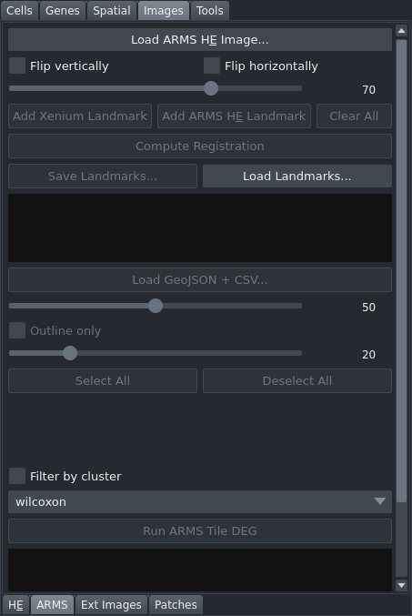

# ARMS Overlay

Load an ARMS (or other fluorescence/brightfield) image, register it to the Xenium coordinate system using landmark-based affine registration, overlay spatial tile polygons coloured by cluster assignment, and run differential expression analysis between tile clusters. This tab is in the "Images" control panel group.

## Controls

### Image loading and orientation

| Control | Description |
|---|---|
| Load ARMS H&E Image... | Opens a file dialog accepting `.ome.tif`, `.tif`, `.tiff`, `.svs` files. |
| Flip vertically | Flips the loaded image vertically. |
| Flip horizontally | Flips the loaded image horizontally. |
| H&E opacity | Slider (0–100, default 70). Controls layer transparency. Disabled until an image is loaded. |

### Landmark registration

The registration workflow is identical to the H&E Registration tab.

| Control | Description |
|---|---|
| Add Xenium Landmark | Activates the Xenium landmark layer in "add point" mode. |
| Add ARMS H&E Landmark | Activates the ARMS image landmark layer in "add point" mode. |
| Clear All | Removes all landmarks and clears the registration affine. |
| Compute Registration | Computes a similarity affine from the landmark pairs. Enabled when 3 or more pairs are present. Shows per-landmark residuals in pixels and µm. |
| Residuals (read-only) | Text area showing registration quality after the last computation. |
| Save Landmarks... | Saves landmarks and affine to a JSON file. Enabled with at least one landmark. |
| Load Landmarks... | Restores landmarks and affine from a JSON file. |

### Tile overlay

| Control | Description |
|---|---|
| Load GeoJSON + CSV... | Prompts for a GeoJSON file (tile boundary polygons) followed by a CSV file (tile name to cluster ID mapping). Renders tiles as a Shapes layer coloured by cluster. |
| Tile opacity | Slider (0–100, default 50). Disabled until tiles are loaded. |
| Outline only | When checked, tiles are rendered as outlines with transparent fill. |
| Tile edge width | Slider (1–100, default 20). Disabled until tiles are loaded. |
| Per-tile-cluster checkboxes | Scrollable 3-column grid of checkboxes — one per cluster. Selects which tile clusters to include in DEG analysis. |

### Tile DEG analysis

| Control | Description |
|---|---|
| DEG Method | Dropdown: "wilcoxon" or "t-test". Selects the statistical test for differential expression. |
| Filter by cluster | When checked, restricts DEG to cells that fall within the active Xenium cluster filter. |
| Run ARMS Tile DEG | Runs differential gene expression between the selected tile cluster groups. |
| Results (read-only) | Text area showing cells per tile cluster and top DEG genes after a run. |
| Export ARMS DEG CSV... | Saves DEG results to a CSV file. Enabled after a successful run. |
| Generate ARMS Volcano Plots... | Saves one PNG volcano plot per cluster pair to a chosen directory. Enabled after a successful run. |
| Select All | Selects all tile cluster checkboxes. |
| Deselect All | Deselects all tile cluster checkboxes. |

## Workflow

1. Click "Load ARMS H&E Image..." and select your image file.
2. Toggle "Flip vertically" or "Flip horizontally" if the image is mirrored.
3. Register the image to the Xenium coordinate system using at least 3 landmark pairs (same procedure as the H&E Registration tab).
4. Click "Load GeoJSON + CSV..." and supply the tile boundary GeoJSON and cluster assignment CSV files.
5. Adjust tile opacity, edge width, and "Outline only" as needed.
6. To run DEG analysis, check at least 2 tile clusters (each with at least 10 cells) and click "Run ARMS Tile DEG".
7. Inspect results in the text area. Optionally export the CSV or generate volcano plots.

## Notes

- Landmarks, affine, tile data, and the ARMS image are all persisted to `sdata_cached.zarr` and restored automatically on the next launch.
- DEG requires at least 2 selected tile clusters, each containing at least 10 cells.
