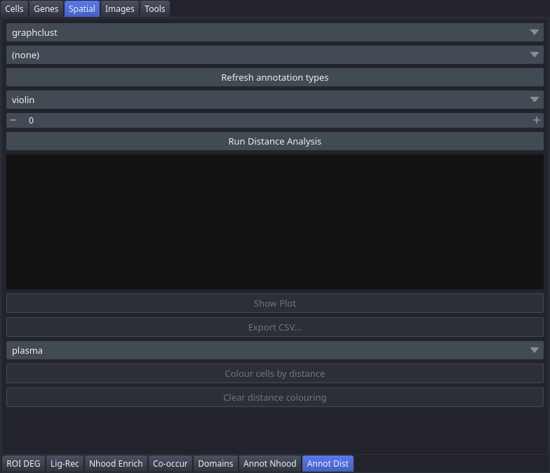

# Annot Dist

The Annot Dist tab computes the minimum distance from each cell to the boundary of a selected annotation type, displays per-cluster distance distributions as violin, box, or strip plots, and can colour cells in the viewer by their distance value.

## Controls

| Control | Description |
|---|---|
| Clustering | Clustering used to group cells in the distribution plot |
| Annotation type | Annotation polygon type to measure distance to |
| Refresh annotation types | Rescans the Annotations layer; use if annotations were added after the tab was opened |
| Plot type | Shape of the distribution plot: `violin`, `box`, or `strip` |
| Max distance to show (µm, 0=all) | Clips the y-axis to this distance in micrometres; set to 0 to show all distances |
| Distance colormap | Colour map applied when colouring cells by distance (e.g. `plasma`) |
| Run Distance Analysis | Computes the minimum distance to the annotation boundary for every cell |
| Results area | Shows min, median, mean, and max distances overall, plus per-cluster medians |
| Show Plot | Renders the distribution plot; enabled after running the analysis. Also saves the figure — see the notes. |
| Export CSV... | Saves a table with cell coordinates, cluster assignment, and a `distance_um` column for each cell; enabled after running. Defaults to the filename `annotation_distances.csv`. |
| Colour cells by distance | Applies distance-based colouring to the cell labels layer using the selected colourmap; enabled after running |
| Clear distance colouring | Restores the previous colourmap; enabled when distance colouring is active |

## Workflow

1. Draw annotation polygons in the Annotations tab, or ensure existing polygons are loaded.
2. Select a **Clustering** and choose the **Annotation type** to measure distance to.
3. Click **Refresh annotation types** if the type does not appear in the dropdown.
4. Choose a **Plot type** and optionally set **Max distance to show** to focus on a spatial range of interest.
5. Click **Run Distance Analysis**.
6. Review per-cluster medians in the results area, then click **Show Plot** to visualise distributions.
7. Click **Export CSV...** to save the per-cell table.
8. Optionally click **Colour cells by distance** to see spatial distance gradients in the viewer; click **Clear distance colouring** to restore the previous display.

## Notes

- At least one annotation polygon of the selected type must exist before running the analysis.
- Distance colouring is independent of other colouring modes; **Clear distance colouring** restores whatever colourmap was active before you applied distance colouring.
- **Show Plot** also writes the figure to `<dataset>/plots/annot_distance.<fmt>`, where the format follows **Preferences → Plot format** (SVG by default, PNG at 300 dpi if selected). No save dialog appears; the file is simply written.
- **The distances are written to `adata.obs['dist_to_<type>_um']`** — one column per annotation type, so measuring against a second type does not overwrite the first. Cells inside the annotation measure to its boundary, not to zero.
- **Every step here is recorded**, so the analysis appears in `analysis.py` and the exported notebook and replays from the raw Xenium output; the drawn annotations travel with it as literal coordinates. The templates are [annot.polygons](Analysis-Templates#annotpolygons), [annot.distance](Analysis-Templates#annotdistance) and [annot.distance_plot](Analysis-Templates#annotdistance_plot), each editable in the [Templates](Tab-Templates) tab.
