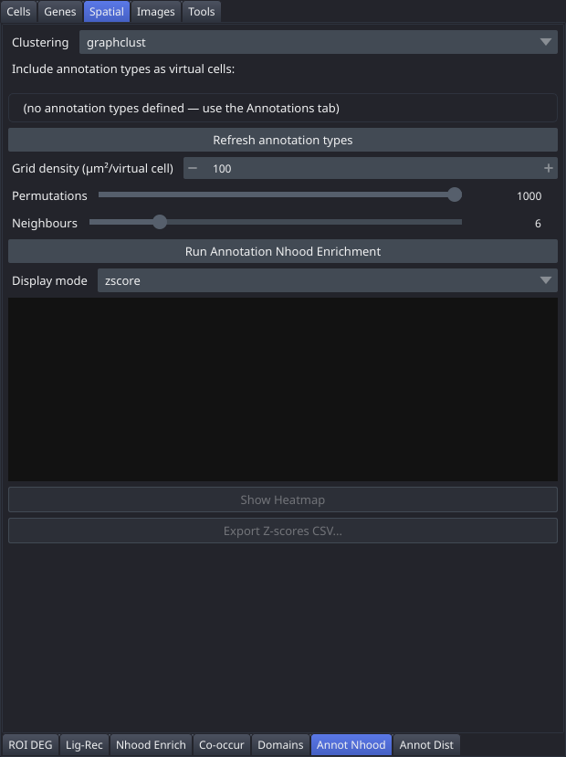

# Annot Nhood

The Annot Nhood tab runs neighbourhood enrichment analysis between real cell clusters and virtual cells sampled from user-drawn annotation polygons, revealing spatial associations between tissue structures and cell types.

## Controls

| Control | Description |
|---|---|
| Clustering | Clustering defining the real cell types used in the analysis |
| Annotation type checkboxes | One checkbox per annotation type found in the Annotations layer; select which types to include as virtual cells |
| Refresh annotation types | Rescans the Annotations layer for available types; use this if annotations were added after the tab was opened |
| Grid density (µm²/virtual cell) | Spinbox (10–10 000, default 100) — area per virtual cell when sampling inside annotation polygons; lower values give denser sampling |
| Permutations | Slider (100–1000, default 1000) — number of permutations for significance testing |
| N neighbours | Slider (3–20, default 6) — neighbourhood size for spatial proximity |
| Run Annotation Nhood Enrichment | Runs the analysis combining real cells and virtual annotation cells |
| Display mode | Controls which matrix is shown in the heatmap: `zscore` or `count` |
| Results area | Shows matrix dimensions, cluster and annotation names, and top enriched pairs |
| Show Heatmap | Displays the enrichment heatmap; enabled after running |
| Export Z-scores CSV... | Saves the Z-score matrix to a CSV file; enabled after running |

## Workflow

1. Draw annotation polygons in the Annotations tab (or load saved annotations).
2. Return to this tab and click **Refresh annotation types** if needed.
3. Select a **Clustering** and check the annotation types you want to include.
4. Set **Grid density**, **Permutations**, and **N neighbours**.
5. Click **Run Annotation Nhood Enrichment** and wait for completion.
6. Choose a **Display mode** and click **Show Heatmap** to inspect results.
7. Export the Z-score matrix with **Export Z-scores CSV...**.

## Notes

- Requires at least one clustering and at least one polygon of each selected annotation type.
- The Z-score matrix rows and columns cover all real cell clusters plus all included annotation types.
- Positive Z-scores indicate that a cell type tends to be found near that annotation type; negative Z-scores indicate spatial avoidance.
- **Show Heatmap** also writes the figure to `<dataset>/plots/annot_nhood_enrichment.<fmt>`, where the format follows **Preferences → Plot format** (SVG by default, PNG at 300 dpi if selected). No save dialog appears; the file is simply written.
- The results area repeats an important caveat: virtual cells carry no gene expression, so the Z-scores here describe spatial proximity alone and are not comparable to expression-based enrichment.
- If no annotation types are found, the checkbox grid shows a placeholder pointing at the [Annotations](Tab-Annotations) tab rather than an empty list.
- **This tab records nothing into the provenance graph**, so its results do not appear in `analysis.py` or the exported notebook. The virtual cells are sampled from a napari shapes layer that a standalone script has no access to, so there is no code that would reproduce them. Export the Z-score CSV if you need the numbers outside the viewer.
