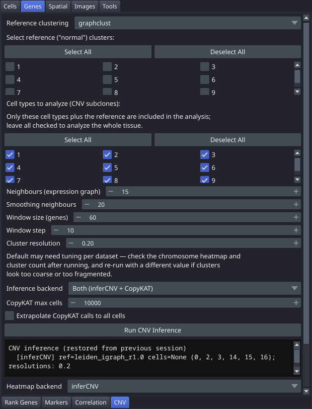

# CNV

Infer copy-number variation from expression data: pick an existing clustering, mark some of its categories as the "normal" reference population, and run inference to get a colourable CNV-subclone clustering, a continuous per-cell CNV score, and a chromosome heatmap. Two backends are available — **inferCNV**, which runs in the main environment, and **CopyKAT**, which runs detached in a second one — and by default both are run. This is the **CNV** tab in the "Genes" control panel group.

Requires the `cnv` optional extra, and CopyKAT additionally requires the `palms_copykat` environment — see [Installation](Installation).

## Controls

### Reference Population

| Control | Description |
|---|---|
| Reference clustering | Existing clustering/annotation to source the "normal" reference population from |
| Cluster checkboxes | Three-column grid under "Select reference ("normal") clusters:" — check which categories of the selected clustering count as reference ("normal") cells; unchecked by default |
| Select All | Checks all reference checkboxes |
| Deselect All | Unchecks all reference checkboxes |

### Cell types to analyze

| Control | Description |
|---|---|
| Cell type checkboxes | Second three-column grid under "Cell types to analyze (CNV subclones):" — restricts inference to a subset of cell types. All checked by default. Only the checked types plus the reference are included; leave everything checked to analyse the whole tissue. |
| Select All | Checks all cell-type checkboxes |
| Deselect All | Unchecks all cell-type checkboxes |

### Parameters

| Control | Description |
|---|---|
| Neighbors (expression graph) | Spin box (5–100, default 15) — neighbors for the expression PCA graph used for smoothing |
| Smoothing neighbors | Spin box (5–200, default 20) — neighbors used by the graph-smoothing step |
| Window size (genes) | Spin box (2–200, default 60) — infercnvpy sliding-window size, in genes, computed independently per chromosome |
| Window step | Spin box (1–50, default 10) — infercnvpy sliding-window step |
| Cluster resolution | Float spin box (0.05–2.0, default 0.2) — Leiden clustering resolution for CNV subclones. Hover for a tooltip, or see the hint text below the field: this default may need tuning per dataset — check the chromosome heatmap and cluster count after running |

Neighbors/Smoothing neighbors/Window size/Window step defaults match InSituCNV's own reference notebook ([`run_insitucnv.ipynb`](https://github.com/Moldia/InSituCNV/blob/main/notebooks/run_insitucnv.ipynb)).

### Backend

| Control | Description |
|---|---|
| Inference backend | Dropdown — **Both (inferCNV + CopyKAT)** (default), **inferCNV only**, or **CopyKAT only**. With the default, a run starts inferCNV in-process and also launches a detached CopyKAT job that takes far longer. |
| CopyKAT max cells | Spin box (500–500 000, default 10 000) — CopyKAT runs on a random subsample of this many cells, since it does not scale to a whole Xenium section |
| Extrapolate CopyKAT calls to all cells | Checkbox (default unchecked) — propagates the subsampled CopyKAT calls to every cell, adding a `<col>_propagated` clustering for each result column |

### Run and Results

| Control | Description |
|---|---|
| Run CNV Inference | Runs the pipeline for the selected backend(s): normalize/PCA/neighbors → smoothing → genomic-position mapping → inference → CNV-profile clustering |
| Results area | Reports reference clustering/categories, genes mapped to the genome, windows produced, CNV clusters found, and CNV score range |
| Heatmap backend | Dropdown — which backend's results the heatmap should be built from. Filled after a run. |
| Heatmap resolution | Dropdown — which stored clustering resolution to draw. Results accumulate, so several resolutions can coexist under one CNV profile. |
| Save Chromosome Heatmap (PDF/PNG) | Saves a chromosome heatmap for the selected backend and resolution to `plots/cnv_heatmap_<backend>_<cluster_key>.png` and `.pdf`; enabled after a run |
| Color Cells by CNV Score | Recolours the labels layer by the continuous per-cell CNV score (viridis); enabled after a run |

## Workflow

1. Select a **Reference clustering** — an existing clustering or cell-type annotation with a clear normal/non-tumor population (e.g. an immune or stromal cluster from Rank Genes annotation, or a built-in `graphclust`).
2. Check the categories that represent the **reference (normal)** population in the first checkbox grid.
3. Optionally narrow the second grid, **Cell types to analyze**, to the populations you care about. Everything unchecked there is excluded from inference along with everything that is not the reference.
4. Adjust **Window size**/**Window step** if needed — these are gene counts, computed independently per chromosome (a chromosome with fewer genes than **Window size** doesn't get dropped; it falls back to a single window averaging all of that chromosome's genes). A larger window trades sub-chromosomal resolution for a less noisy per-window estimate. The results panel reports how many genes mapped to the genome and how many windows were produced so you can judge result quality and tune accordingly.
5. Choose an **Inference backend**. Leave it at **Both** to get inferCNV's answer immediately and CopyKAT's later; choose **inferCNV only** if you do not have the second environment installed.
6. Click **Run CNV Inference**. On the first run, infercnvpy's human (GRCh38) gene-position reference is downloaded and cached automatically (requires internet access).
7. Once inferCNV completes, the result is registered as a new clustering (`cnv_leiden_res<resolution>`, e.g. `cnv_leiden_res0.2`) and automatically applied as the active colouring — it's also usable everywhere clusterings are, e.g. as the groupby in Rank Genes or the cluster source in ROI DEG.
8. Pick a **Heatmap backend** and **Heatmap resolution**, then click **Save Chromosome Heatmap (PDF/PNG)** to export gain/loss patterns across chromosomes per CNV cluster. The heatmap is not displayed in a window — building it can be slow, so it is saved directly instead.
9. Click **Color Cells by CNV Score** to switch the spatial view to a continuous CNV-burden overlay instead of discrete clusters.

## Notes

- **Human panels only.** The GRCh38 gene-position reference is the only annotation table available, so a run refuses outright when under 5% of the panel maps to gene coordinates, and says so — the message calls out mouse nomenclature explicitly, since that is the usual cause. A mouse annotation table would be needed to support mouse panels.
- The reference population must be explicitly chosen; no cluster is treated as "normal" by default, and at least one reference category is required to run.
- **CopyKAT runs as a detached background process** in the separate `palms_copykat` environment, taking roughly two hours. It survives closing the viewer — if you quit mid-run you are asked whether to stop it, leave it running in the background, or cancel quitting. Its results are picked up the next time you open the dataset.
- CopyKAT is unavailable under `--no-cache`, which reports "CopyKAT needs the zarr cache".
- CopyKAT produces its own clustering keys — `copykat_leiden_res<resolution>` alongside `cnv_status` and `copykat_pred` — kept separate from inferCNV's, so the two backends' answers can be compared rather than overwriting one another.
- With **Extrapolate CopyKAT calls to all cells** ticked, each of those columns gains a `<col>_propagated` twin covering every cell: a cell CopyKAT did not sample takes the majority call of its group in the reference clustering, and a group with no sampled cell at all becomes `unknown`.
- Only CopyKAT uses the **Preferences → CPU cores** setting; inferCNV ignores it.
- The full CNV profile (per-window values, gene positions) is cached in `<dataset>/viewer_cache/` as `adata_cnv_cache_<backend>.h5ad` with a `cnv_<backend>_result.json` summary, so the chromosome heatmap can be regenerated after reopening the dataset without recomputing the pipeline. CopyKAT additionally leaves its input and parameters there, and run markers in `plots/`.
- Results persist across sessions like any other clustering; reopening the dataset restores the results summary and re-enables the heatmap/score-colouring buttons.
- The **Cluster resolution** default (0.2) is a starting point, not a universal recommendation — InSituCNV's own notebook evaluates several resolutions per dataset before picking one. If clusters look too coarse (few, large clusters mixing distinct CNV profiles) or too fragmented (many tiny clusters), re-run with a different resolution and compare the chromosome heatmaps; both resolutions stay available in the **Heatmap resolution** dropdown.
- The inferCNV run is a templated step, so the exact code it executes can be read — and changed — in the [Templates](Tab-Templates) tab. CopyKAT is not: it runs in another interpreter, so its recorded cell states in line that it is a reconstruction rather than the code that ran.
