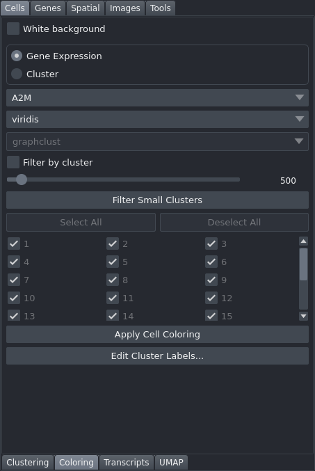

# Coloring

The Coloring tab controls how cells in the segmentation layer are rendered: you can colour them by continuous gene expression or by discrete cluster assignment, and optionally hide clusters that are too small or not of interest. Changes take effect only when you click **Apply Cell Coloring**, which also updates the linked [UMAP](Tab-UMAP) window.

## Controls

| Control | Description |
|---|---|
| White background | Checkbox. Toggles the napari canvas background between black (default) and white. |
| Color cells by | Radio buttons: **Gene Expression** or **Cluster**. Selects the colouring mode. |
| Gene | Dropdown (all gene names). Gene to display when Gene Expression mode is active. |
| Colormap | Dropdown. Colour map applied to gene expression values (default: viridis). Options include viridis, plasma, magma, inferno, cividis, and others. |
| Clustering | Dropdown. Clustering used for Cluster mode and for cluster-level visibility filtering. |
| Filter by cluster | Checkbox. When enabled, reveals a grid of per-cluster checkboxes for manual visibility control. |
| Min cluster size | Slider (100–10 000, default 500). Cell-count threshold used by **Filter Small Clusters**. |
| Filter Small Clusters | Button. Automatically unchecks clusters whose cell count is below **Min cluster size**. |
| Select All | Button. Checks all per-cluster visibility checkboxes. |
| Deselect All | Button. Unchecks all per-cluster visibility checkboxes. |
| Per-cluster checkboxes | Grid. Shows one checkbox per cluster; uncheck a cluster to hide those cells. |
| Apply Cell Coloring | Button. Applies all current settings to the cell labels layer and refreshes the UMAP window. |

## Workflow

1. Choose a **Clustering** from the dropdown if you intend to colour by cluster or filter by cluster identity.
2. Select your colouring mode with the **Color cells by** radio buttons.
   - In **Gene Expression** mode, pick a **Gene** and **Colormap**.
   - In **Cluster** mode, each cluster receives a distinct categorical colour.
3. To hide unwanted clusters, enable **Filter by cluster**, then either use **Filter Small Clusters** with an appropriate **Min cluster size**, or uncheck individual clusters manually.
4. Click **Apply Cell Coloring** to commit changes to the viewer.

## Notes

- The display does not update in real time; you must click **Apply Cell Coloring** after every change.
- Cluster filtering and gene expression colouring are fully compatible: you can colour cells by gene expression while hiding specific clusters.
- The last applied state is saved to the session and restored automatically on the next launch.
