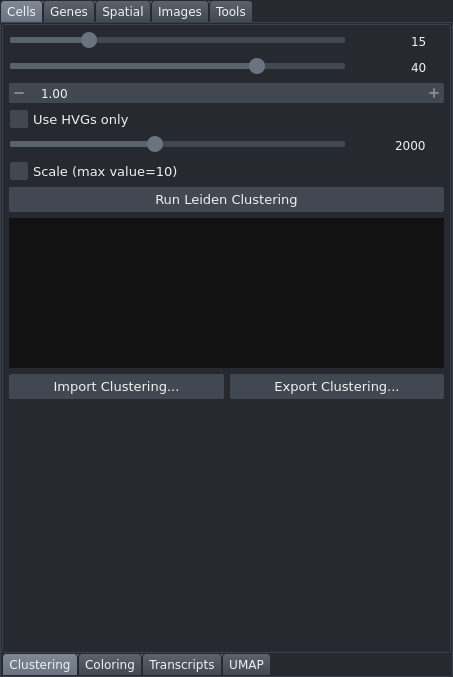

# Clustering

The Clustering tab lets you run Leiden clustering on the cell expression matrix with adjustable graph and resolution parameters, import pre-computed cluster assignments from an external file, and export the current result for downstream use. Clusters produced here are immediately available to all other tabs that accept a clustering input.

## Controls

| Control | Description |
|---|---|
| n_neighbors | Slider (5–50, default 15). Number of nearest neighbours used to build the kNN graph. Higher values produce coarser, more stable clusters. |
| n_pcs | Slider (10–50, default 40). Number of principal components used when constructing the kNN graph. |
| resolution | Float spinbox (0.1–5.0, step 0.1, default 1.0). Leiden resolution parameter. Higher values produce more, smaller clusters. |
| Use HVGs only | Checkbox (default unchecked). When checked, restricts the analysis to highly variable genes and enables the n_top_genes slider. |
| n_top_genes | Slider (500–4000, default 2000). Number of highly variable genes selected when "Use HVGs only" is active. |
| Scale (max_value=10) | Checkbox (default unchecked). Scales the expression matrix to unit variance, capping values at 10. |
| Run Leiden Clustering | Button. Executes Leiden clustering. The result is stored under the key `leiden_r{resolution}` (e.g. `leiden_r1.0`). |
| Import Clustering... | Button. Opens a file dialog to load cluster assignments from a CSV or TSV file with columns `cell_id` and `group`. |
| Export Clustering... | Button. Saves the active clustering to a CSV or TSV file. |
| Status text area | Read-only. Displays the clustering key, number of clusters found, and the parameters used to produce the result. |

## Workflow

1. Adjust **n_neighbors**, **n_pcs**, and **resolution** to suit your dataset size and the granularity you need.
2. Optionally enable **Use HVGs only** and set **n_top_genes** to speed up computation on large datasets.
3. Optionally enable **Scale (max_value=10)** if you want variance-scaled input.
4. Click **Run Leiden Clustering**. Check the status area for the result key and cluster count.
5. Switch to [Coloring](Tab-Cell-Coloring) or [Gene Analysis](Tab-Gene-Analysis) to use the new clustering.
6. To use an externally computed partition, click **Import Clustering...** and select a CSV/TSV file with `cell_id` and `group` columns. The filename becomes the clustering key.
7. To save results for sharing or downstream scripts, click **Export Clustering...**.

## Notes

- The result key is deterministic: re-running with identical parameters produces the same key and overwrites the previous result.
- Imported clusterings appear alongside computed ones in every clustering dropdown across the viewer.
- To rename clusters for display and export, use the **Edit Cluster Labels...** button in the [Gene Analysis](Tab-Gene-Analysis) tab.
