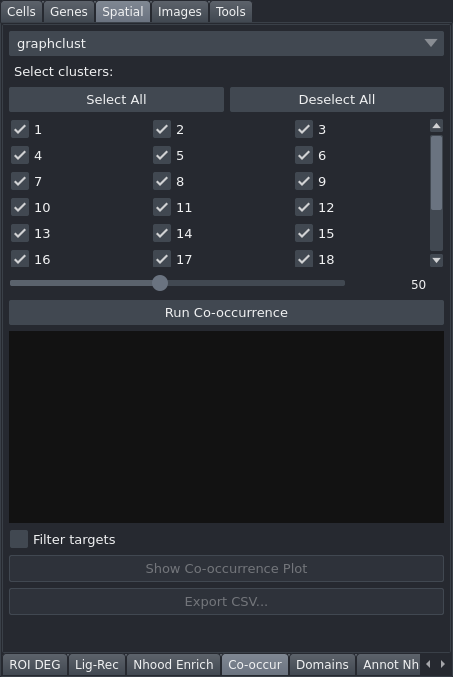

# Co-occur

The Co-occur tab analyses how frequently pairs of cell clusters appear together across a range of spatial distances, producing a co-occurrence score as a function of distance that reveals at what scales clusters are associated or mutually exclusive.

## Controls

| Control | Description |
|---|---|
| Clustering | Clustering to analyse |
| Distance bins | Slider (10–100, default 50) — number of distance bins to compute |
| Run Co-occurrence | Computes the co-occurrence array across all distance bins |
| Cluster checkboxes | Three-column grid — select which source clusters to include in the plot |
| Select All | Checks all cluster checkboxes |
| Deselect All | Unchecks all cluster checkboxes |
| Filter targets | When checked, uses the active cluster selection from Cell Coloring to filter which target clusters appear in the plot |
| Show Co-occurrence Plot | Displays subplots for each selected source cluster showing co-occurrence vs. distance for all target clusters; enabled after running. Also saves the figure — see the notes. |
| Export CSV... | Saves a table with columns `source_cluster`, `target_cluster`, `distance`, `co_occurrence`; enabled after running |

## Workflow

1. Select a **Clustering** from the dropdown.
2. Set the number of **Distance bins** (more bins give finer resolution but take longer).
3. Click **Run Co-occurrence** and wait for completion.
4. Use the cluster checkboxes to choose which source clusters to visualise, then click **Show Co-occurrence Plot**.
5. Optionally enable **Filter targets** to restrict target clusters to those currently selected in Cell Coloring.
6. Click **Export CSV...** to save the co-occurrence table.

## Notes

- A co-occurrence score greater than 1 indicates the cluster pair appears together more than expected by chance at that distance; a score less than 1 indicates avoidance.
- Results are persisted to `adata.uns['co_occurrence']` and restored automatically on the next load.
- **Show Co-occurrence Plot** also writes the figure to `<dataset>/plots/co_occurrence.<fmt>`, where the format follows **Preferences → Plot format** (SVG by default, PNG at 300 dpi if selected). No save dialog appears; the file is simply written.
- **Export CSV...** writes only the source clusters currently ticked, not every cluster in the clustering.
- A progress bar under **Run Co-occurrence** tracks the computation, which is the slow part on a large section.
