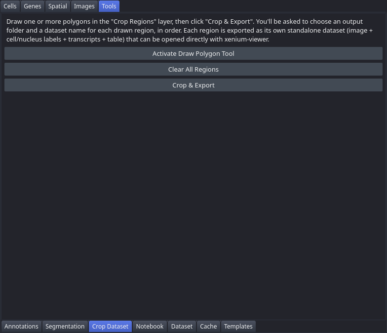

# Crop Dataset

Draw one or more polygons in the "Crop Regions" layer and export each as its own standalone, independently-openable palms data directory — a cropped morphology image, cell/nucleus labels, transcripts, AnnData table, and everything you registered or drew on top, ready to `palms <output_dir>`. This tab is in the "Tools" control panel group.

## Controls

| Control | Description |
|---|---|
| Activate Draw Polygon Tool | Selects the "Crop Regions" Shapes layer and switches it into polygon-drawing mode, so the next clicks on the canvas start a new polygon. |
| Clear All Regions | Removes all drawn polygons from the "Crop Regions" layer. |
| Include registered overlays and regions | On by default. Carries the registered H&E, ARMS section, external images, patch overlays, ROIs, annotations, ARMS tiles and registration landmarks into each export, cropped to the same region. Untick for a bare core-elements-only export. |
| Crop & Export | Exports every drawn polygon as a separate dataset. Prompts for an output folder and a dataset name for each region, in order, then runs the crop in the background with a progress dialog. |

## Workflow

1. Select the "Crop Regions" Shapes layer in the napari layer list (or click "Activate Draw Polygon Tool").
2. Draw one or more polygon outlines around the tissue regions you want to export. Press Enter to close each polygon.
3. Click "Crop & Export". For each drawn polygon, in order:
   - A folder picker asks where to save the exported dataset.
   - A name prompt asks for the dataset's folder name (e.g. `core_A`). If that folder already exists, you're asked to confirm overwriting it.
4. A progress dialog tracks each region's export (image/label cropping, cell and transcript filtering, writing the dataset, building the transcript cache).
5. A summary dialog reports success or failure per region, with the output path for each successful export.
6. Open a completed export directly: `palms <output_dir>/<name>`.

## Notes

- Images and cell/nucleus label rasters are cropped to each polygon's **pixel bounding box** (a rectangle), not the exact polygon outline. Cells and transcripts, however, are filtered to the **exact drawn polygon** via a true point-in-polygon test, so the exported cell table and transcript points are precise even though the image extends slightly beyond the drawn shape.
- `cell_labels` and `nucleus_labels` are both masked so they only contain cells/nuclei kept in the exported table. `nucleus_labels` pixel values are an independent numbering unrelated to `cell_id`/`cell_labels`, so this isn't done by matching ID numbers — a nucleus is kept if it spatially overlaps a kept cell's footprint in the cropped raster. A nucleus straddling the boundary between a kept and an excluded cell is kept if it overlaps the kept cell at all.
- **Registered overlays and drawn regions travel with the crop** (issue #27). A registered H&E, an ARMS section, external images, patch overlays, ROIs, annotations and ARMS tiles are each cropped to the same region and written into the export, so an exported core opens with its alignment intact. Custom segmentation is still out of scope — the tab requires native Xenium segmentation to run at all.
- How each one is carried depends on what its coordinates mean, and **the authority on that is the live viewer, not the element**. An overlay placed by an affine — H&E, ARMS, `ext_*`, `patch_*`, ARMS tiles — keeps its own pixels and has the crop composed into its transform; an element genuinely in Xenium pixels (ROIs, annotations) has its geometry moved into the crop frame. Either way the drawn region is used to clip, so patches and cell circles outside the crop are dropped rather than shipped.
- **Why the element alone is not enough.** A registration is only written onto the element when you (re-)register or flip; an H&E restored from the cache and never touched again carries an *identity* transform while its real affine lives in the viewer. `arms_tiles` and `patch_*` overlays never get one at all — they are drawn with a linked layer's affine. Read off the element, all of those look like plain Xenium-pixel data, and the crop would slice a rectangle out of the wrong picture. The frames are therefore resolved from the layers on screen at the moment you press Crop & Export, falling back to the element's stored transform, then to identity.
- **An overlay whose frame cannot be established is not sliced.** If a raster declares an identity transform and its extent is not the morphology grid — so "already in Xenium pixels" cannot be true — the export skips it and says so in the summary, naming both extents. Slicing on a guess is the one irreversible step here: the other pixels simply are not in the export. Register the overlay in the source dataset and re-export.
- **Registration landmarks are never filtered**, even the ones that fall outside the crop. The affine is a least-squares fit over the whole landmark set, so dropping part of it would fit a *different* transform and the export would re-derive an alignment that no longer matches the one it shipped with. A landmark outside the cropped image is harmless — it is a reference point, not data.
- An overlay that does not overlap the crop at all, or that cannot be carried for any other reason, is skipped and named in the summary dialog rather than failing the whole export.
- Requires native Xenium segmentation — if a custom segmentation is active (see the Segmentation tab), revert to Xenium segmentation before cropping.
- Each exported dataset is fully standalone: it includes its own `experiment.xenium`, a prebuilt SpatialData zarr cache, `transcripts.parquet`, and a prebuilt transcript feather cache, so it opens at full speed without re-processing. It also carries a `viewer_session` and its own copy of the **provenance graph** (with the paths rewritten to the export and a `crop_export:<name>` node recording how it was made), so the exported notebook explains where its data came from. Transient window state and cached DEG results are not inherited. Registration affines are deliberately *not* copied into that session — the exported element carries its own placement, and a second copy would drift the moment you re-registered inside the export. One consequence worth knowing: the flip checkboxes read unticked in an export even for a flipped overlay, because the flip is already baked into the element's transform, so "flip" there means "flip it again".
- Exported datasets have no raw Xenium output files (no `cells.zarr.zip`, `cell_feature_matrix`, etc.) — only the zarr cache and derived transcript files. They always load from that cache, even when the viewer is launched with `--no-cache`, since there's nothing else to load them from.
- **Because the cache is the only copy, the viewer will not rebuild it.** An export is stamped `cache_only` in its cache manifest, and a dataset with no raw Xenium files beside it is recognised as such even without the stamp. Such a cache is never reported stale, is never moved aside, and the [Cache](Tab-Cache) tab's Force Rebuild is disabled for it. Previously a copy or a sync that made `experiment.xenium` newer than the cache was enough to trigger a rebuild that had nothing to read, which left the dataset unopenable.
- Exported datasets have no `analysis/` folder, so there's no separate precomputed UMAP/clustering CSVs to load. All of the source dataset's clusterings (built-in ones like `graphclust`/`kmeans_*` and any custom/Leiden ones), subset to the exported cells, are carried over automatically and available immediately in the Clustering tab and every analysis tab's clustering selector — no need to recompute after cropping. Cluster labels (the human-readable names assigned via "Edit Cluster Labels...") carry over too, per clustering. If the source dataset's UMAP was already computed at crop time, those coordinates (for the kept cells) also carry over and the UMAP tab still works; if not, the UMAP tab starts empty until you compute one.
- A region with no cells inside it, or an invalid/self-intersecting polygon, is reported as a failure for that region without affecting the rest of the batch.
- **A large crop is bounded in memory, not proportional to its size.** Nothing is materialised as a dense array on the way to disk — the image, labels and transcripts stay lazy through the write — so a crop spanning most of a slide peaks around 10 GB rather than scaling with the region. Most of the wall clock is the transcript feather cache at the end, which writes each gene exactly once.
- If a crop is interrupted, its staging directory is left behind as `.<name>__crop_tmp` for a post-mortem rather than cleaned up. A completed or cleanly failed crop removes it. Deleting a stray one by hand is safe; it is not in the [Dataset](Tab-Dataset) tab's deletable roots, because it sits beside the *destination*, which the viewer does not own.
