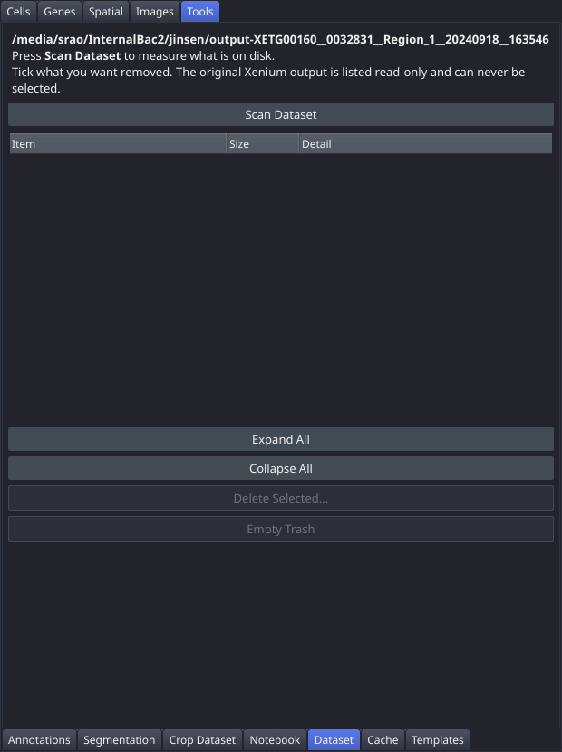

# Dataset

Inventory everything this dataset holds on disk — the original Xenium output, the viewer's zarr cache, saved session state, derived analysis caches, and backups — with a size for each, then tick what you no longer want and delete it. Answers the question the [Cache](Tab-Cache) tab cannot: not "is the store healthy" but "where did the space go, and how do I get rid of something". The original 10x output is listed read-only and can never be selected. This is the **Dataset** tab in the "Tools" control panel group.

## Controls

| Control | Description |
|---|---|
| Scan Dataset | Walks the dataset directory and the zarr cache and fills the tree with per-item sizes. Nothing is scanned when the viewer starts — a full walk of a 30 GB store on every launch would be unreasonable — so this is always the first step. Re-scanning keeps whatever you had already ticked. |
| Item tree | Three columns: **Item**, **Size**, **Detail**. Rows are grouped into the five sections below. Selection is by **checkbox only** — clicking a row does not highlight it. A row that cannot be deleted is dimmed and unticksable, with the reason as its tooltip. |
| Expand All | Expands every section and group in the tree. |
| Collapse All | Collapses the tree back to its five section rows. |
| Select Stale Results... | Disabled until a scan has run. Ticks the rows holding the results of steps the [Notebook](Tab-Notebook) tab marks stale — a step is stale when something it depends on was re-run with different settings, so its stored result no longer matches the recorded code — then offers to delete them through the same confirmation dialog as the button below. The steps themselves stay in the provenance graph, so the notebook still replays and recreates whatever you clear. A report above the tree lists what was ticked, what was deliberately left alone, and why. |
| Delete Selected... | Disabled until a scan has run. Builds a deletion plan from the ticked rows and shows a confirmation dialog listing every item, its size and its full path before anything is touched. |
| Empty Trash | Enabled only when the cache has a `.xv_trash` directory. Removes the previous copies of elements kept aside by earlier writes — that is, exactly what the [Cache](Tab-Cache) tab's "previous version" recovery restores from. |
| Report area | Appears after the first deletion. Lists what was removed and how much was reclaimed, and names each item that could not be removed with its reason. |

### Inventory sections

| Section | What it lists | Removable |
|---|---|---|
| Original Xenium output | Everything in the dataset directory the viewer did not create, identified by exclusion. | Never — "original 10x output — the viewer never modifies it". |
| Viewer cache | The `sdata_cached.zarr` elements, grouped by type (images, labels, points, shapes, tables), with the table expanding into its individual `obs`, `uns` and `obsm` entries. | Mostly yes. The core elements (`tables/table`, `labels/cell_labels`, `labels/nucleus_labels`, `images/morphology_focus`, `points/transcripts`) are listed with sizes but blocked. |
| Session state | The contents of `viewer_session/` — ROIs, the H&E and ARMS affines, cluster labels, marker-gene lists, external-image and patch-overlay state. | Yes, except the provenance graph and `segmentation_source`. |
| Derived caches | The sidecars in `viewer_cache/` (`adata_norm_cache.h5ad`, `adata_cnv_cache_*.h5ad`, `roi_deg_cache.parquet`, `arms_tile_deg_cache.parquet`, `cnv_*_result.json`) and the per-gene `transcript_cache/`. | Yes — all regenerable, though some at considerable cost. |
| Backups & trash | Sibling `sdata_cached_prev_*.zarr` / `sdata_cached_backup_*.zarr` / `sdata_cached_corrupt_*.zarr` stores, and `.xv_trash`. | Yes — but read the warning below first. |

## Workflow

1. Click **Scan Dataset** and wait for the tree to fill. The header line above it reports the dataset's total size and how much of it the viewer wrote.
2. Expand the sections to find what is taking space. The **Detail** column explains what each item is; the **Size** column is measured, not estimated.
3. Tick the items you want removed. Blocked rows are dimmed — hover for the reason.
4. Click **Delete Selected...**. The confirmation dialog groups the plan by kind, prints every path, totals the space to be reclaimed, and calls out two things specifically: items that will be removed **because they only make sense together** with something you ticked, and items for which **no backup copy is kept**.
5. Confirm. The report area lists what was removed and names any failure individually — a partly applied batch is always describable.
6. If you deleted a zarr element, the tab offers to reload the dataset. Accept it: the viewer built its layers and tabs from disk at load time and does not re-read it, so until you reload it still has the old elements in memory.

## Notes

- **Deletion is confined by containment, not by a list of known-bad names.** A path is removable only if it resolves inside `sdata_cached.zarr`, `viewer_cache/`, `transcript_cache/`, or a `sdata_cached_*_*.zarr` backup. The raw Xenium output is in none of them, so it is refused outright rather than merely hidden from the tree.
- **Anything unrecognised defaults to not deletable.** An unfamiliar file in the dataset directory is treated as raw output; an unfamiliar element or `obs` column is left alone.
- Symlinks are resolved before the containment test but never followed when sizing or deleting, so a link pointing out of the dataset cannot be used to delete something outside it.
- **Most of this is not recoverable.** Only zarr *elements* go through `.xv_trash`. Sidecars, derived caches, session state, backups and trash itself are removed outright — those rows carry the tooltip "Not recoverable — no copy is kept."
- **Emptying the trash or deleting a backup destroys what the [Cache](Tab-Cache) tab would recover from.** If a cache has been behaving oddly, verify it there before reclaiming space here.
- **A clustering is more than one column.** A Leiden run leaves the bare `<key>`, a `clustering_<key>`, and once you name the clusters a `cluster_labels_<key>`. Ticking one takes all of them, so "delete this clustering" does not leave an identical copy behind.
- Deleting an external image also removes its two landmark shape layers, since the landmarks are meaningless without the image they register.
- Deleting `obs`/`uns`/`obsm` entries rewrites the whole table, so those rows have no path of their own. The rewrite happens **once** per batch however many entries you tick, and a deleted clustering disappears from every clustering dropdown in the viewer immediately.
- If a deletion fails with "in use", the element is still backed by a live napari layer — reload the dataset when offered and try again.
- Written into the dataset folder but outside the viewer's deletable directories: `analysis.py`, `analysis_notebook.ipynb`, `plots/` and `palms.log`. They are listed read-only; remove them by hand if you want them gone.
- Deleting `transcript_cache/` reclaims real space but drops transcript loading back to scanning `transcripts.parquet` (seconds per gene instead of milliseconds) until `palms-preprocess` is run again.
- The tab still works under `--no-cache`. Nothing is being written in that session, but earlier sessions may well have left sidecars and backups on disk.
