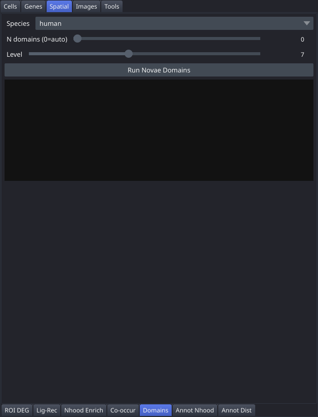

# Domains

The Domains tab infers spatial tissue domains using the Novae deep learning model, applying zero-shot inference from pretrained human or mouse weights to assign each cell to a spatially coherent domain without requiring manual annotation or clustering parameters.

## Controls

| Control | Description |
|---|---|
| Species | Selects the pretrained Novae model: `human` or `mouse` |
| N domains (0=auto) | Slider (0–30) — target number of domains; set to 0 to let the model choose automatically |
| Level | Slider (1–15, default 7) — hierarchical level for domain assignment; lower values produce coarser domains |
| Run Novae Domains | Downloads the pretrained model on first use and runs inference |
| Results area | Shows the number of domains found and instructions for next steps |

## Workflow

1. Select the correct **Species** for your tissue.
2. Set **N domains** to 0 for automatic selection, or enter a target number if you know how many domains to expect.
3. Adjust **Level** to control domain granularity (start with the default of 7).
4. Click **Run Novae Domains**. On the first run the pretrained model is downloaded automatically; subsequent runs use the cached model. A progress bar tracks inference.
5. When inference completes the domains are applied to the canvas automatically, and the linked UMAP window updates with them. Use the [Coloring](Tab-Cell-Coloring) tab only if you switch to a different colouring and want to come back.

## Notes

- Requires the `novae` package: `pip install novae`. Without it the tab reports exactly that.
- The model used is `MICS-Lab/novae-<species>-0`, run in zero-shot mode.
- The result is added as a clustering named `novae_domains` and immediately available in all clustering dropdowns across other tabs. It is written into the cell table, so it survives a restart like any other clustering, and it is recorded into the analysis provenance so it appears in the exported notebook.
- Inference typically takes 1–5 minutes depending on dataset size.
