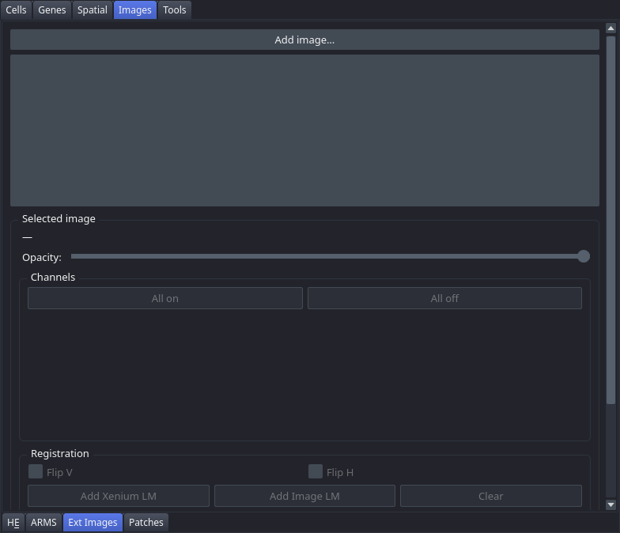

# External Images

Load one or more multichannel OME-TIFF images as RGB composites with per-channel colour and contrast controls, and optionally register each image to the Xenium coordinate system using landmark-based affine registration or by linking to another registered layer's affine. This tab is in the "Images" control panel group.

## Controls

### Image list

| Control | Description |
|---|---|
| Add image… | Opens a file dialog to select **one** OME-TIFF, TIFF, or SVS file. The file is loaded as an RGB composite napari layer and appears in the image list. Repeat for each further image. |

### Selected image panel

The panel below the image list updates when you click an image in the list.

| Control | Description |
|---|---|
| Opacity | Slider (0–100, default 100). Controls the blending opacity of the selected layer. |
| Channel visibility checkbox | One per channel. Enables or disables individual channels. |
| Channel colour button | Opens a colour picker for the corresponding channel. |
| Channel contrast slider | Dual-handle slider setting the minimum and maximum contrast limits for the channel. Updates are debounced by 100 ms to avoid excessive redrawing. |
| All on | Enables all channels simultaneously. |
| All off | Disables all channels simultaneously. |

### Registration

| Control | Description |
|---|---|
| Flip V | Flips the image vertically. |
| Flip H | Flips the image horizontally. |
| Add Xenium LM | Creates the Xenium landmark layer and activates "add point" mode. |
| Add Image LM | Creates the image-side landmark layer and activates "add point" mode. |
| Clear | Deletes all landmarks and clears the registration affine. |
| Compute Registration | Computes a similarity transform from the landmark pairs. Enabled when 3 or more pairs are placed. Shows residuals in µm. |
| Or apply transform from: | Dropdown listing other registered layers (for example, H&E). Links this image's affine to the selected layer; the affine updates automatically if the source layer moves. |
| Remove image | Deletes the layer, its landmarks, and the associated sdata entries. |

## Workflow

1. Click "Add image…" and select an OME-TIFF file. It is added as its own layer. To load several images, repeat this step once per file — the dialog takes one at a time.
2. Click a layer in the image list to select it and display its controls.
3. Adjust per-channel visibility, colour, and contrast as needed.
4. Register the image to the Xenium coordinate system using one of two approaches:
   - Place at least 3 landmark pairs with "Add Xenium LM" / "Add Image LM", then click "Compute Registration".
   - If another image is already registered (for example, an H&E image), choose it in the "Or apply transform from:" dropdown to inherit its affine.
5. Repeat for additional images as needed.

## Notes

- The "Or apply transform from:" dropdown is useful when the external image is already spatially aligned to a registered H&E or ARMS image — no additional landmark placement is needed.
- Channel contrast changes are debounced (100 ms) to avoid excessive redrawing during slider interaction.
- Landmarks and affines are persisted to `sdata_cached.zarr`, and the image list and its per-channel settings are restored on the next launch.
- Deleting an image in the [Dataset](Tab-Dataset) tab also removes its two landmark layers, since landmarks are meaningless without the image they register.
