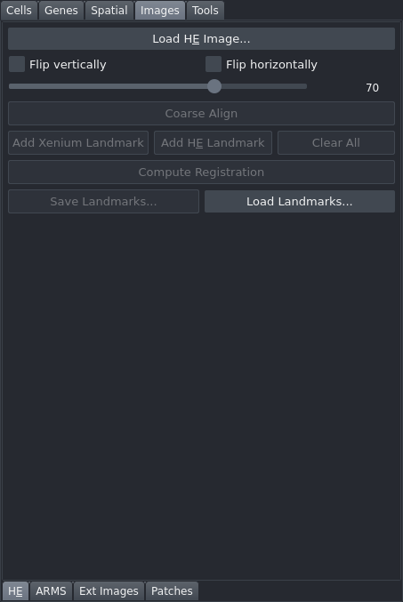

# H&E Registration

Load an H&E (or other brightfield) TIFF image, align it to the Xenium coordinate system using optional coarse tissue-outline alignment followed by manual landmark-based registration, and persist the affine transform. This tab is in the "Images" control panel group.

## Controls

### Loading and orientation

| Control | Description |
|---|---|
| Load H&E Image... | Opens a file dialog accepting `.ome.tif`, `.tif`, `.tiff`, `.svs` files. Loads the image as a multi-scale pyramid and adds it to the napari canvas. |
| Flip vertically | Flips the H&E image vertically by applying a flip affine. |
| Flip horizontally | Flips the H&E image horizontally. |
| H&E opacity | Slider (0–100, default 70). Controls H&E layer transparency. Disabled until an image is loaded. |

### Coarse alignment

| Control | Description |
|---|---|
| Coarse Align | Automatically aligns tissue outlines between the Xenium morphology image and the H&E image. Computes a coarse affine (scale + translation) that brings the images into approximate registration. Disabled until an image is loaded. |

### Landmark registration

| Control | Description |
|---|---|
| Add Xenium Landmark | Activates the Xenium landmark layer in "add point" mode. Click a recognisable feature in the Xenium image to place a landmark. |
| Add H&E Landmark | Activates the H&E landmark layer in "add point" mode. Click the corresponding feature in the H&E image. |
| Clear All | Removes all landmarks and clears the fine registration affine. |
| Compute Registration | Computes a similarity affine from the placed landmark pairs. Enabled when 3 or more pairs are present. Displays per-landmark residuals (pixels and µm), mean and max residuals, and the computed scale factor. |
| Residuals (read-only) | Text area showing registration quality metrics after the last computation. |
| Save Landmarks... | Saves landmarks and the computed affine to a JSON file. Enabled when at least one landmark is present. |
| Load Landmarks... | Restores landmarks and affine from a previously saved JSON file. |

The combined affine applied to the H&E image is composed as: flip affine then coarse affine then fine landmark affine.

## Workflow

1. Click "Load H&E Image..." and select your file.
2. If the image appears mirrored, toggle "Flip vertically" or "Flip horizontally".
3. (Optional but recommended) Click "Coarse Align" to roughly align tissue outlines before placing landmarks.
4. Place at least 3 landmark pairs:
   1. Click "Add Xenium Landmark", then click a recognisable feature (for example, a vessel or duct) in the Xenium morphology image.
   2. Click "Add H&E Landmark", then click the same feature in the H&E image.
   3. Repeat for at least 3 features spread across the tissue.
5. Click "Compute Registration". Inspect the residuals — values under 10–20 µm are typically acceptable.
6. (Optional) Click "Save Landmarks..." to save the result for sharing or future reuse.

## Notes

- Registration is persisted automatically to `sdata_cached.zarr` and restored on the next launch; you do not need to redo registration between sessions.
- The H&E image itself is also stored in the zarr cache, so you do not need to re-load the original file on subsequent sessions.
