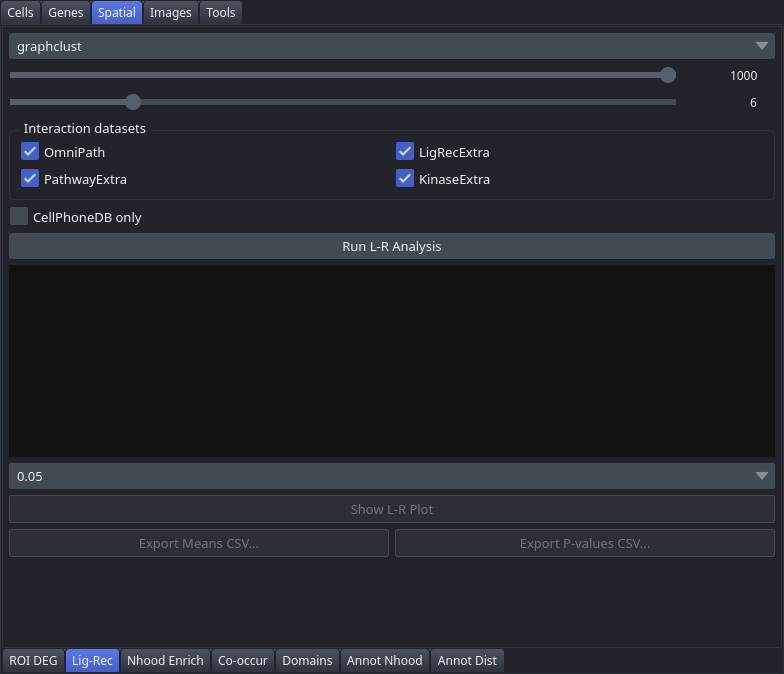

# Lig-Rec

The Lig-Rec tab tests for significant ligand-receptor interactions between spatially adjacent cell clusters using squidpy and the OmniPath database, producing mean interaction strengths and permutation-based p-values.

## Controls

| Control | Description |
|---|---|
| Clustering | Clustering that defines sender and receiver cell types |
| Permutations | Slider (100–1000, default 1000) — number of permutations for significance testing |
| N neighbors | Slider (3–20, default 6) — neighbourhood size used to define spatial proximity |
| Interaction datasets | Group box holding the four database checkboxes below |
| OmniPath | Include OmniPath interactions (default checked) |
| LigRecExtra | Include LigRecExtra interactions (default checked) |
| PathwayExtra | Include PathwayExtra interactions (default checked) |
| KinaseExtra | Include KinaseExtra interactions (default checked) |
| CellPhoneDB only | Restrict the analysis to CellPhoneDB interactions only (default unchecked) |
| Run L-R Analysis | Computes mean interaction strengths and permutation p-values across all selected databases |
| Results area | Interaction counts and the top 20 interactions by significance, filled after a run |
| P-value threshold | Filters which interactions are shown in the plot: `0.001`, `0.005`, `0.01`, or `0.05`. Defaults to `0.05`. |
| Show L-R Plot | Displays a dotplot of significant interactions; enabled after running the analysis. Also saves the figure — see the notes. |
| Export Means CSV... | Saves the mean interaction strength matrix to a CSV file; enabled after running |
| Export P-values CSV... | Saves the full p-value matrix to a CSV file; enabled after running |

## Workflow

1. Select a **Clustering** from the dropdown.
2. Adjust **Permutations** and **N neighbors** as needed.
3. Check or uncheck the interaction database checkboxes to define which resources to query.
4. Click **Run L-R Analysis** and wait for completion.
5. Review the interaction counts and top 20 interactions in the results area.
6. Set a **P-value threshold** and click **Show L-R Plot** to inspect significant interactions.
7. Export results with **Export Means CSV...** or **Export P-values CSV...**.

## Notes

- A clustering must be selected before running the analysis.
- The p-value threshold only affects what is shown in the plot; the full result set is always available for export regardless of the threshold.
- Results are persisted to `adata.uns['ligrec']` and restored automatically on the next load.
- **Show L-R Plot** also writes the figure to `<dataset>/plots/ligrec.<fmt>`, where the format follows **Preferences → Plot format** (SVG by default, PNG at 300 dpi if selected). No save dialog appears; the file is simply written.
- If a cluster filter is active in the [Coloring](Tab-Cell-Coloring) tab, the plot restricts both source and target groups to those clusters.
- A progress bar under **Run L-R Analysis** tracks the permutation test, which dominates the runtime.
- Which database checkboxes you ticked is carried into the exported notebook, so a replay queries the same resources rather than falling back to defaults.
