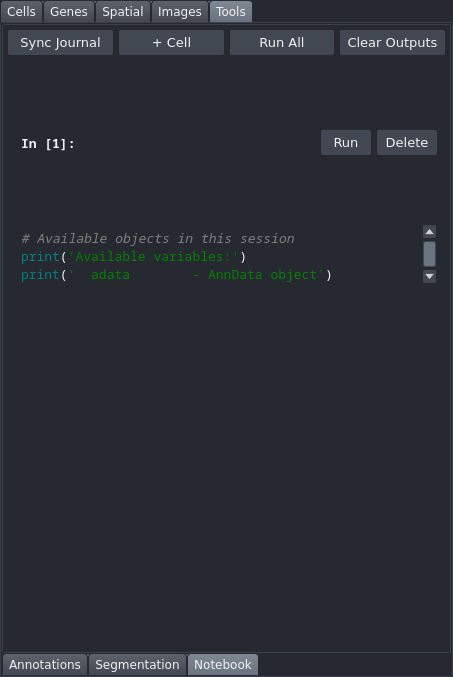

# Notebook

An interactive Python code editor embedded in the viewer, with per-cell execution, inline output display (print output, return values, and figures), and synchronisation with the provenance graph that other tabs record their actions into. This tab is in the "Tools" control panel group.

## Controls

### Toolbar

| Control | Description |
|---|---|
| Sync Graph | Rebuilds the recorded cells from the provenance graph, in dependency (topological) order. Recorded steps appear on their own as they happen, so this is a manual re-sync — useful after editing cells, or to restore the dependency ordering. |
| + Cell | Adds a new blank code cell at the bottom of the notebook. |
| Run All | Executes all cells from top to bottom in order. |
| Clear Outputs | Hides all cell output areas. Cell code is not affected. |
| Show DAG | Opens a rendered diagram of the provenance graph, showing each step and the dependencies between them, and saves it to `<dataset>/plots/provenance_dag.png`. |
| Drop Stale Nodes... | Removes stale steps from the provenance graph, after showing exactly which ones and saving a timestamped backup of the graph. A stale step whose result is still stored in the dataset is called out, since dropping the step leaves that result with nothing to explain it. A stale step that a step which is *still current* depends on is kept, and the dialog names what is holding it. |
| Export .ipynb | Opens a save dialog, defaulting to `analysis_notebook.ipynb` in the dataset directory, and writes the graph out as a notebook. The notebook replays from the raw Xenium output. |

### Per-cell controls

| Control | Description |
|---|---|
| Code editor | Monospace, auto-resizing text area. Write or edit Python code for this cell. |
| Run | Executes this cell and displays output inline below it. |
| Delete | Hides this cell. For a recorded step this is display-only — the step is still in the provenance graph, and "Sync Graph" brings the cell back. Use **Drop Stale Nodes...** to actually remove a step. |

### Output area

Shown below each cell after execution:

| Output type | Display |
|---|---|
| Return value | Shown as `Out: ...` |
| Standard output | Captured and displayed in monospace. |
| Matplotlib figures | Rendered as inline images. |
| Standard error | Displayed in orange. |
| Exceptions | Displayed in red with a traceback. |

## Workflow

- A welcome cell listing available objects is inserted automatically when the tab is first opened.
- Actions taken in other tabs (clustering, DEG, spatial analysis, and so on) are recorded into the provenance graph and appear here **automatically as they happen**. Click "Sync Graph" to re-derive the cells from the graph — for instance after editing them, or to restore topological ordering.
- A step whose inputs have since changed carries a `⚠ stale — input changed; re-run in the viewer` badge. Re-run that step in its own tab to clear it.
- Three things you can do about a stale step: **re-run it** in its own tab, which is usually what you want; **clear its stored result** with [Dataset](Tab-Dataset) → "Select Stale Results...", which keeps the step so the notebook still recreates it; or **drop the step** with "Drop Stale Nodes...", which removes it from the notebook for good.
- If *every* step is stale at once, the usual cause is that the dataset directory was moved or renamed rather than that anything is wrong: the viewer re-records the preamble with the new path on each launch, and that alone flags everything downstream. Run `palms-rename-dataset <path> --repair` and the staleness goes away with the results intact.
- Cells share a single Python execution context: variables defined in one cell are available in all subsequent cells.
- Write exploratory code directly in new cells added with "+ Cell", then run them individually or with "Run All".
- To capture a Matplotlib figure inline, assign it to a variable or call `plt.show()` at the end of the cell.

## Notes

- Available objects in the notebook context: `adata`, `sdata`, `viewer`, `ctx`, `clusterings`, `color_manager`, `gene_names`, `data_path`.
- Dropping stale nodes writes the shrunken graph to **both** places it is stored — the sidecar and the session copy in the zarr — so the steps stay gone after a restart. A backup of the graph as it was is left in `<dataset>/viewer_cache/prov_graph.backup_<time>.json`; those backups are never offered for deletion by the [Dataset](Tab-Dataset) tab.
- **The provenance graph is written to disk after every recorded step**, as `<dataset>/viewer_cache/prov_graph.json`, and *also* saved into `sdata_cached.zarr/viewer_session/` when the session is saved. On load the sidecar wins, because it is the one that is current while the viewer is still open or if it was killed. Either way, recorded steps accumulate across sessions into a single notebook.
- Free-form cells you type into the tab yourself are scratch space and are not persisted; move anything worth keeping into a file, or rely on the recorded steps. Edits you make to a recorded cell are reconciled back against the graph and marked as hand-edited, so a reader can tell them apart from what the viewer recorded.
- Two files are written into the dataset directory automatically: `analysis.py` (a flat script) and `analysis_notebook.ipynb` (the notebook export). Both replay from the raw Xenium output.
- Steps that describe viewer state with no code equivalent — canvas background, overlay visibility, a crop export — are recorded as **notes** and render as markdown rather than as code, so they are not mistaken for steps that failed to record anything.
- If any step ran a customised template (see [Templates](Tab-Templates)), the exported notebook opens with a banner naming those steps.
- If a step cannot be recorded, a napari warning names the node and the failure is logged with a traceback and counted in the [Cache](Tab-Cache) tab's header. Recording failures are never silent.
- Whether steps are recorded at all is controlled by **Preferences → Record reproducible code**; the same menu can write the derived script elsewhere or continue appending to an existing one.
- That a replayed notebook reproduces the viewer's results is checked rather than assumed: a test in CI replays an exported notebook in a clean kernel and requires the clusterings to match exactly, and `scripts/verify_notebook.py` performs the same comparison against a real dataset.
