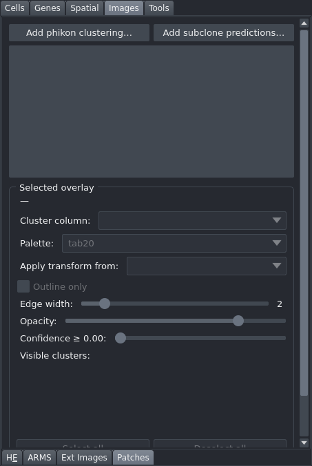

# Patches

Overlay phikon patch-clustering results or subclone predictions as coloured rectangular patches on the Xenium canvas, with controls for cluster visibility, colour palette, edge styling, confidence filtering, and spatial alignment to a registered image. This tab is in the "Images" control panel group.

## Controls

### Loading

| Control | Description |
|---|---|
| Add phikon clustering... | Opens a directory dialog to select a phikon results folder. Extracts patch coordinates, sizes, and cluster columns from the folder contents. |
| Add subclone predictions... | Opens a file dialog to select a subclone CSV file. |

### Selected overlay panel

The panel below the overlay list updates when you click an overlay entry.

| Control | Description |
|---|---|
| Cluster column: | Dropdown to select which column is used for patch colouring (for example, `phikon_cluster` or `subclone_id`). |
| Palette: | Dropdown: "tab10", "tab20", "glasbey_dark", "Set1", "Set3", or "ARMS (Set1+Set2+Dark2)". Applies the chosen colour palette to cluster colours. Defaults to "tab20", or to "ARMS (Set1+Set2+Dark2)" for a subclone CSV. |
| Apply transform from: | Dropdown listing registered image layers. Links this overlay's affine to the selected layer for spatial alignment with the Xenium data. |
| Outline only | When checked, patches are rendered as outlines with transparent fill. |
| Edge width: | Slider (0–20, default 2), with the current value shown beside it. Controls the thickness of patch outlines. |
| Opacity: | Slider (0–100, default 80). Controls the blending opacity of the patch layer. |
| Confidence ≥ 0.00: | Slider (0.00–1.00). Hides patches whose confidence score falls below the threshold. Only available when the source file contains confidence data. |
| Cluster checkboxes | Scrollable grid of per-cluster checkboxes under a "Visible clusters:" label. Uncheck a cluster to hide its patches. |
| Select all | Checks all cluster checkboxes. |
| Deselect all | Unchecks all cluster checkboxes. |
| Remove overlay | Deletes the overlay layer and all associated data. |

## Workflow

1. Click "Add phikon clustering..." to load a phikon results folder, or "Add subclone predictions..." to load a subclone CSV.
2. Click the overlay in the list to open its controls.
3. Choose the appropriate cluster column from the "Cluster column:" dropdown.
4. Select a colour palette.
5. If the patch coordinates are in a different spatial reference than Xenium, choose a registered layer from "Apply transform from:" to co-register the patches.
6. Use the cluster checkboxes to show or hide individual clusters.
7. Adjust opacity, edge width, and "Outline only" to suit your display preferences.

## Notes

- Multiple overlays can be loaded simultaneously; each is tracked and controlled independently.
- Overlays persist across sessions. The loaded files, chosen columns, palettes and visibility settings are saved with the session, and the alignment itself is stored in the dataset, so reopening restores what you had.
- Linking patch affines to a registered H&E or ARMS image via "Apply transform from:" is the recommended way to co-register patch overlays with Xenium data when coordinates are defined in the external image's reference frame.
