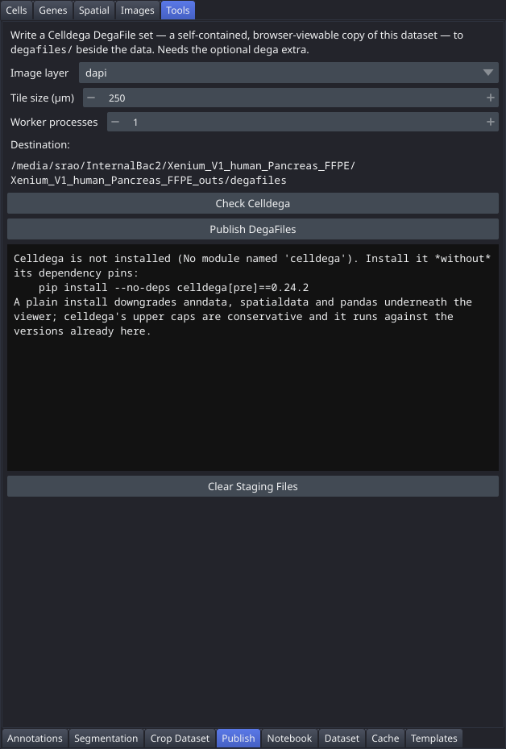

# Publish

Export the open dataset as a **Celldega DegaFile** set — a self-contained, browser-viewable copy of the section. A PALMS session already ends as a replayable [notebook](Tab-Notebook); this makes it end as a *viewable* artifact too, so a collaborator with neither the raw 10x output nor a Linux box can still look at the data. Export only: the viewer does not read DegaFiles. This tab is in the "Tools" control panel group.



## Controls

| Control | Description |
|---|---|
| Image layer | Which morphology channels to tile. `dapi` is the nuclear channel alone and is what Celldega's own Xenium tutorial uses; `all` tiles every channel and costs proportionally more time and disk. |
| Tile size (µm) | Edge length of one Celldega tile, in microns. 250 is their default. |
| Worker processes | How many processes celldega uses to generate tiles. 1 by default — the timing below was measured there. |
| Check Celldega | Reports whether the optional dependency is importable, and if not, prints the exact install command. celldega is never imported until you press this or Publish. |
| Publish DegaFiles | Runs the export in the background. The viewer stays usable; the elapsed time is shown in the status bar. |
| Clear Staging Files | Removes the working directory under `viewer_cache/dega_staging/`. Safe at any time — it only makes the next export slower. |

## Workflow

1. Click **Check Celldega**. If it is missing, the readout prints the exact install command — see "Installing the dependency" under Notes below.
2. Set the image layer, tile size and worker count. The defaults are Celldega's own.
3. Click **Publish DegaFiles**. Expect **several minutes** — 322 s for a 10.6 × 6.3 mm pancreas section, most of it tiling the DAPI pyramid.
4. When it finishes, the readout gives the output path and the two lines that open it:

   ```python
   from celldega.viz import landscape
   landscape(base_url='/path/to/dataset/degafiles')
   ```

5. Copy or upload `degafiles/` to share it. It is self-contained: no server, no PALMS, no raw 10x output.

## Notes

- **The export goes to `<dataset>/degafiles`, and the destination is not configurable.** It sits beside `plots/`, outside every directory the viewer is allowed to delete, so a cache rebuild cannot throw away something you published. It is fixed rather than chosen because the recorded step would otherwise carry an absolute path, and a notebook replayed on another machine would write somewhere surprising. Move the folder afterwards if you want it elsewhere.
- **The raw 10x output is never written to.** `celldega.pre.main` calls an unzipper that `os.chdir`s into the dataset directory and runs `gzip`/`unzip`/`tar` *in place*, leaving roughly 200 MB of decompressed duplicates beside your data — and failing outright on the read-only mount a shared dataset often sits on. The export instead runs against a farm of symlinks under `viewer_cache/dega_staging/<dataset>/`, with the four archives unpacked into the farm first. Verified on a real dataset: the output directory is byte-for-byte unchanged after a complete export.
- **The staging directory is worth keeping between exports.** celldega skips any archive it finds already unpacked, so a second export is much cheaper. Clear it when you want the disk back; the [Dataset](Tab-Dataset) tab lists it too, since everything in `viewer_cache/` belongs to the viewer.
- **The export is recorded.** It appears in the [Notebook](Tab-Notebook) tab as `export:degafiles`, a terminal step whose cell calls `palms.utils.dega_export.export_degafiles`. It calls the wrapper rather than celldega directly on purpose: a notebook cell that called `celldega.pre.main` would decompress into the reader's own copy of the raw data. See [export.degafiles](Analysis-Templates#exportdegafiles).
- **The DegaFile set is a snapshot, not a live view.** Clusterings, annotations and registrations computed after an export are not in it; publish again to pick them up. Re-publishing overwrites in place and revises the same provenance node.
- What is written: `pyramid_images/` (WebP Deep Zoom), `transcript_tiles/`, `cell_segmentation/`, `cbg/`, `cell_clusters/`, `cell_metadata.parquet`, `meta_gene.parquet`, `df_sig.parquet`, `micron_to_image_transform.csv` and `landscape_parameters.json` — about 220 MB for the pancreas section above.

### Installing the dependency

celldega is an optional extra and **must be installed with `--no-deps`**:

```bash
conda activate palms
pip install --no-deps 'celldega[pre]==0.24.2'
```

Two things about that command are not optional.

- **`--no-deps`.** celldega 0.24.2 caps `anndata<0.13` and `spatialdata<0.8` while the viewer runs 0.13 and 0.8, so a plain `pip install celldega` *succeeds* and quietly downgrades anndata, spatialdata, pandas and ome-zarr underneath the viewer. Those caps are conservative rather than real — a full export was measured against anndata 0.13.2, spatialdata 0.8.0 and pandas 3.0.5, over every one of them. The extra is deliberately out of `palms[full]` for this reason.
- **`[pre]`, not bare `celldega`.** `pyvips` is what tiles the morphology image, and celldega declares it only under that extra; their import of it is a `try`/`except` that leaves the module bound to `None`. A bare install therefore runs for several minutes, reaches "generating dapi image tiles", and dies with `AttributeError: 'NoneType' object has no attribute 'Image'`.
