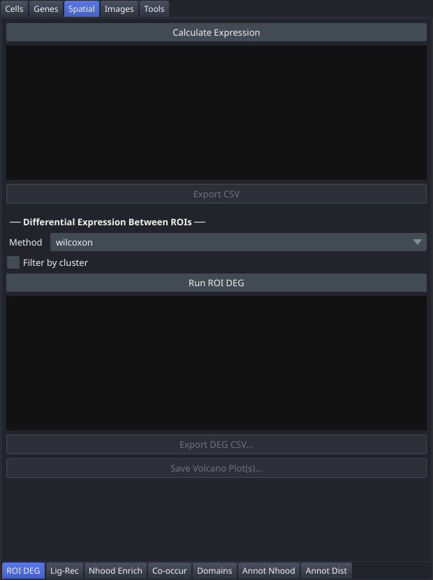

# ROI DEG

The ROI DEG tab analyses gene expression within hand-drawn ROI polygons on the napari canvas, computes per-region summary statistics, and runs differential expression analysis between regions with volcano plot export.

## Controls

### Expression Analysis

| Control | Description |
|---|---|
| Calculate Expression | Computes per-cell expression statistics for each ROI polygon on the Shapes layer; outputs per-region mean, median, std, min, and max, plus all pairwise Welch's t-tests with Benjamini-Hochberg FDR correction |
| Results area | Read-only text display of per-region statistics |
| Export CSV | Saves per-cell data (region ID, cell ID, centroid coordinates, expression value) to a CSV file; enabled after calculation |

### DEG Analysis

| Control | Description |
|---|---|
| Method | Statistical test for differential expression: `wilcoxon` or `t-test` |
| Filter by cluster | When checked, restricts DEG to cells in the currently active cluster filter |
| Run ROI DEG | Runs differential expression between all pairs of ROI regions |
| DEG results area | Read-only display of the top 50 differentially expressed genes |
| Export DEG CSV... | Saves the full DEG results table to a CSV file; enabled after running DEG |
| Save Volcano Plot(s)... | Generates one PNG volcano plot per region pair (LFC threshold 1.0, p-value threshold 0.01, 300 dpi), named `roi_volcano_<a>_vs_<b>.png`, and saves them to a chosen directory; enabled after running DEG |

## Workflow

1. In the napari canvas, select the "ROI polygons" Shapes layer and use the polygon drawing tool to draw two or more ROI regions.
2. Select the gene of interest in the [Coloring](Tab-Cell-Coloring) tab's **Gene** dropdown — that is the gene this tab analyses. You do not need to click **Apply Cell Coloring**; only the dropdown value is read.
3. Click **Calculate Expression** to compute per-region statistics.
4. Review the results in the text area, then click **Export CSV** to save per-cell data if needed.
5. For differential expression between regions, click **Run ROI DEG**.
6. Export the full DEG table with **Export DEG CSV...** or save per-pair volcano plots with **Save Volcano Plot(s)...**.

## Notes

- At least two ROI polygons are required to run DEG analysis.
- ROI polygons are automatically saved when the viewer closes and restored on the next load.
- A cell belongs to an ROI when its centroid falls inside the drawn polygon (`spatialdata.polygon_query`). A centroid landing exactly on the boundary counts as inside. Where two ROIs overlap, a cell is assigned to the **last** one drawn — each cell carries one region label.
- A polygon drawn across its own edge (a figure-eight) is repaired before the test, and every lobe is kept.
- When **Filter by cluster** is checked, only cells belonging to the active cluster selection contribute to the DEG test. Note that this checkbox affects the **DEG** analysis only — **Calculate Expression** always follows the cluster filter set in the [Coloring](Tab-Cell-Coloring) tab, whether or not this box is ticked.
- DEG results are cached to `<dataset>/viewer_cache/roi_deg_cache.parquet` and restored on the next launch, so reopening the dataset does not mean re-running the test.
- A progress bar under **Run ROI DEG** tracks the pairwise comparisons.
