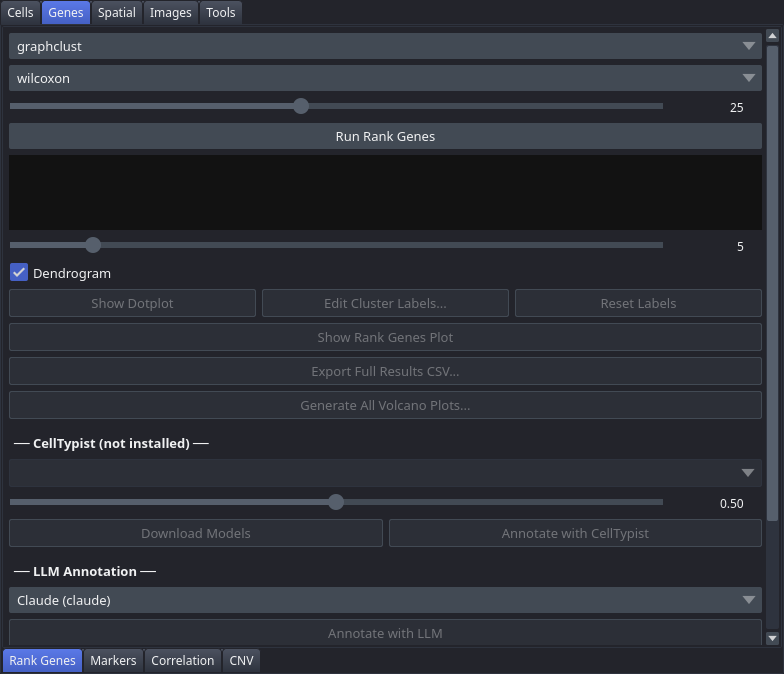

# Rank Genes

The Rank Genes tab lets you compute per-cluster marker genes using differential expression testing, visualise results as dotplots, rank-gene plots, and volcano plots, and annotate clusters automatically using CellTypist, a language model, or label transfer from a reference dataset.

## Controls

### Rank Genes Computation

| Control | Description |
|---|---|
| Clustering | Clustering whose groups define foreground vs. background in the statistical test |
| Method | Statistical test: `wilcoxon`, `t-test`, or `logreg` |
| Top N genes | Slider (5–50, default 25) — number of top marker genes to retain per cluster |
| Run Rank Genes | Executes marker gene analysis; results are required before plots or annotation are available |
| Results area | Preview of the top 50 ranked genes across clusters, filled after a run |

### Visualisation

| Control | Description |
|---|---|
| Genes per cluster | Slider (3–20, default 5) — number of genes shown per cluster in the dotplot |
| Dendrogram | When checked (default), includes a cluster dendrogram in the dotplot |
| Show Dotplot | Generates a scanpy dotplot (mean expression + fraction detected) and writes it to `<dataset>/plots/dotplot.<fmt>` |
| Show Rank Genes Plot | Generates a multi-panel rank-genes overview plot. Displayed only — this one is not written to disk. |
| Edit Cluster Labels... | Opens a dialog to rename clusters; labels propagate to all exports and plots. The same button is also in the [Coloring](Tab-Cell-Coloring) tab. |
| Reset Labels | Clears the custom cluster labels for the **currently selected clustering** and restores its original cluster names. Other clusterings' labels are untouched. |
| Export Full Results CSV... | Saves the full ranked gene table to a CSV file |
| Generate All Volcano Plots... | Saves one volcano plot per cluster pair to a chosen directory |

### CellTypist Annotation

Requires the `celltypist` package.

| Control | Description |
|---|---|
| CellTypist Model | Select from downloaded models |
| Min confidence | Float slider (0.0–1.0, default 0.5) — minimum per-cell prediction confidence to accept |
| Download Models | Downloads available CellTypist models from the internet |
| Annotate with CellTypist | Runs annotation; predictions are majority-voted per cluster and stored as cluster labels |

### LLM Annotation

| Control | Description |
|---|---|
| LLM Provider | Language model to use: `Claude (claude)`, `Gemini (gemini)`, or `Codex (codex)` |
| Annotate with LLM | Sends top-N genes per cluster to the LLM and stores returned cell-type names as cluster labels. Runs the provider's **command-line tool**, so that tool must be installed, on `PATH` and already authenticated — see the notes. |

### Label Transfer

| Control | Description |
|---|---|
| Reference Dataset / Browse... | Built-in reference dropdown or a custom `.h5ad` file via file dialog |
| Annotation Column | Column in the reference `obs` table to transfer |
| Load Reference | Loads the selected reference h5ad into memory |
| Run Label Transfer | Runs `sc.tl.ingest()` against the reference; predictions are majority-voted per cluster |

## Workflow

1. Select a clustering from the **Clustering** dropdown.
2. Choose a **Method** and set **Top N genes**, then click **Run Rank Genes**.
3. Adjust **Genes per cluster** and toggle **Dendrogram**, then use **Show Dotplot** or **Show Rank Genes Plot** to visualise results.
4. Optionally rename clusters with **Edit Cluster Labels...** before exporting.
5. To annotate clusters automatically, choose one of the three annotation methods:
   - **CellTypist** — download a model, set confidence threshold, click **Annotate with CellTypist**.
   - **LLM** — select a provider and click **Annotate with LLM** (that provider's CLI must be installed and authenticated).
   - **Label Transfer** — load a reference dataset, pick an annotation column, click **Run Label Transfer**.
6. Export ranked genes with **Export Full Results CSV...** or save volcano plots with **Generate All Volcano Plots...**.

## Notes

- You must click **Run Rank Genes** before any visualisation or annotation method becomes available.
- CellTypist and LLM annotation both use the ranked gene lists computed in step 2.
- Label Transfer does not require rank genes; it operates directly on the expression matrix.
- Cluster labels set here propagate to exports in all other tabs.
- **LLM annotation shells out to a local command-line tool**, not to an API endpoint — `claude`, `gemini` or `codex` depending on the provider chosen. There is no API key setting: whichever CLI you pick must be installed, on `PATH`, and already signed in. A call that does not return within two minutes is abandoned.
- **Show Dotplot** writes to `<dataset>/plots/dotplot.<fmt>` without a save dialog, where the format follows **Preferences → Plot format** (SVG by default, PNG at 300 dpi if selected). **Preferences → Plot font size** applies to it too. **Show Rank Genes Plot** displays only.
- The test runs on the shared normalised expression data rather than raw counts, and the notebook records that normalisation as its own step. Results from before this changed may differ slightly.
- One ranking is kept per clustering, so ranking a second clustering does not discard the first.
