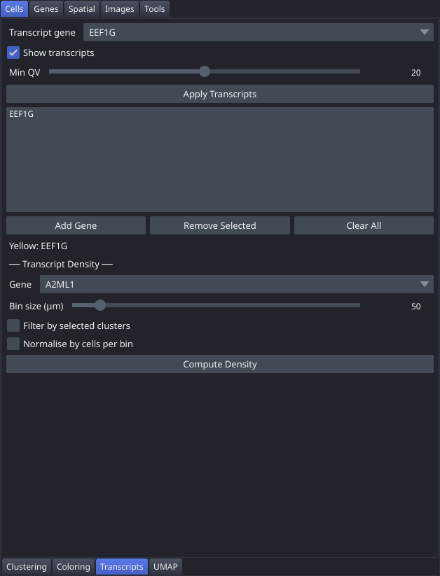

# Transcripts

The Transcripts tab lets you overlay raw transcript locations as colour-coded point clouds (up to 10 genes at once) and compute 2D spatial density heatmaps for any single gene, with optional quality filtering and cell-level subsetting. The overlay and density layers are independent and can be displayed simultaneously.

## Controls

### Transcript Overlay

| Control | Description |
|---|---|
| Transcript gene | Dropdown. Gene to add to the display list. |
| Add Gene | Button. Appends the selected gene to the list (maximum 10 genes; duplicates are ignored). |
| Remove Selected | Button. Removes the highlighted gene from the list. |
| Clear All | Button. Removes all genes from the list. |
| Gene list | List widget. Shows all currently selected genes. Each gene is assigned a fixed colour by list position: Yellow, Cyan, Magenta, Orange, Green, Sky Blue, Red, Violet, Pink, Brown. |
| Show transcripts | Checkbox. Whether the next **Apply Transcripts** loads the overlay or clears it. It does not act on its own — see the notes. |
| Min QV | Slider (0–40, default 20). Records the quality threshold the transcripts were filtered at. Read at preprocessing time, not at display time — see the notes. |
| Apply Transcripts | Button. Loads transcript coordinates for all genes in the list and renders them as a napari points layer. Nothing in this section takes effect until you press it. |
| Colour legend | Label under the gene list showing the colour assigned to each loaded gene, e.g. `Yellow: EPCAM | Cyan: PTPRC`. |

### Density

| Control | Description |
|---|---|
| Gene (density section) | Dropdown. Gene to use for the density heatmap. |
| Bin size (µm) | Slider (10–500, default 50). Spatial bin size in micrometres. |
| Filter by selected clusters | Checkbox. Restricts the density calculation to transcripts located within cells belonging to the currently visible clusters (requires an active cluster filter in the [Coloring](Tab-Cell-Coloring) tab). |
| Normalise by cells per bin | Checkbox. Divides each bin's transcript count by the number of cells in that bin, producing a per-cell density estimate. |
| Compute Density | Button. Computes a 2D transcript density histogram into the transcript density image layer. |

## Workflow

1. Select a gene from the **Transcript gene** dropdown and click **Add Gene**. Repeat for each additional gene (up to 10).
2. Make sure **Show transcripts** is ticked, then click **Apply Transcripts** to load and display the point overlay.
3. To hide the overlay again, either untick the layer in the napari layer list, or untick **Show transcripts** and press **Apply Transcripts** a second time.
4. For a density heatmap, choose a gene in the density section's **Gene** dropdown, set **Bin size (µm)**, and enable optional filters.
5. Click **Compute Density**. The heatmap is a separate layer and can be adjusted independently in the napari layer list.

## Notes

- **Nothing in the overlay section happens until you click Apply Transcripts.** Ticking or unticking **Show transcripts** on its own has no effect — the checkbox is only read when **Apply Transcripts** runs, and it decides whether that run loads the points or clears them. To hide the overlay without a reload, untick the layer in the napari layer list instead.
- **Min QV does not filter at display time.** The per-gene feather files are already filtered when `palms-preprocess` builds them, at the threshold given to that command. The slider records the value into the analysis provenance so the notebook says which threshold produced the points, but changing it will not change what is displayed. To use a different quality threshold, re-run `palms-preprocess` with `--min-qv`.
- Without preprocessing, each gene load scans the full `transcripts.parquet` file, which takes roughly 4–5 seconds per gene. Running `palms-preprocess` once on the dataset creates per-gene feather files and reduces load time to under 100 ms per gene.
- Colour assignment in the point overlay is determined by list position, not gene name. If you remove and re-add a gene, it may receive a different colour. The colour legend under the gene list shows the current assignment.
- If **Filter by selected clusters** is used with a transcript cache built before cell assignment was stored, the density falls back to filtering whole bins rather than individual cells, and the status message ends `[WARNING: rebuild transcript cache for cell-level filtering]`.
- The density heatmap and transcript point overlay are independent napari layers. Adjusting one does not affect the other.
