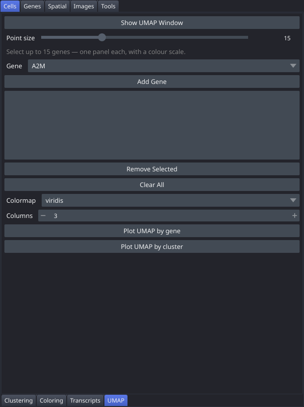

# UMAP

The UMAP tab does two things: it opens a linked scatter window showing cells projected into two-dimensional UMAP space, and it produces publication UMAP figures — one panel per selected gene with its own colour scale, or a single panel coloured by a clustering. The scatter window updates automatically whenever you apply a new colouring in the [Coloring](Tab-Cell-Coloring) tab.

## Controls

| Control | Description |
|---|---|
| Show UMAP Window | Button. Opens a separate floating napari window displaying the UMAP scatter plot, coloured by the currently active colouring. |
| Point size | Slider (1–50, default 15). Controls point size in the UMAP window. The slider value is divided by 100 to produce a fractional size argument. |
| Gene | Dropdown over every gene in the panel. Pick one, then **Add Gene**. |
| Add Gene / Remove Selected / Clear All | Buttons. Build the list of genes to plot; up to 15. |
| Colormap | Dropdown: viridis, magma, plasma, RdBu_r, YlOrRd. |
| Columns | Spin box (1–6, default 3). Panels per row in the gene grid. |
| Plot UMAP by gene | Button. Draws the selected genes and adds the figure to the [Plots](Plots-Window) dock. |
| Plot UMAP by cluster | Button. Draws the clustering selected in the [Coloring](Tab-Cell-Coloring) tab, with cluster labels on the points. |

## Workflow

1. Click **Show UMAP Window** to open the interactive scatter plot. If the window is already open, clicking again brings it to the foreground.
2. Adjust **Point size** to find a point size that is legible at your screen resolution.
3. For a gene figure: choose a gene, click **Add Gene**, and repeat. One gene gives a single panel with a colour bar; several give a grid **Columns** wide. Click **Plot UMAP by gene**.
4. For a cluster figure: select the clustering in the [Coloring](Tab-Cell-Coloring) tab, then click **Plot UMAP by cluster**.
5. Both figures appear in the **Plots** dock and are written to `<dataset>/plots/` in every format set under **Preferences → Plot format** (PNG and PDF by default).

## Notes

- Gene expression is read from the normalised copy `adata_norm` (counts per cell scaled to 10,000, then `log1p`), not from raw counts — the same values every other expression-based analysis in the viewer uses.
- **A clustering must be selected before plotting by cluster.** With none selected, the button reports "No clustering selected" and does nothing.
- Cluster label renames applied in [Rank Genes](Tab-Rank-Genes) are reflected in the figure.
- UMAP coordinates come from `analysis/umap/gene_expression_2_components/projection.csv` in the Xenium output directory and are stored in `adata.obsm['X_umap']`. If that file is absent — as it is in a dataset produced by [Crop Dataset](Tab-Crop-Dataset) — the coordinates already in `adata.obsm['X_umap']` are used instead, so the tab still works. It is empty only when neither source exists.
- **The recorded step reads the same `projection.csv` the viewer does**, so a replayed notebook reproduces the figure that was on screen. Only when the dataset has no `analysis/` folder does the step fall back to recomputing the embedding with `sc.pp.neighbors` + `sc.tl.umap`, which produces an equally valid but different layout — the recorded cell says so in a comment.
- The gene list is saved with the session and restored on the next launch.
