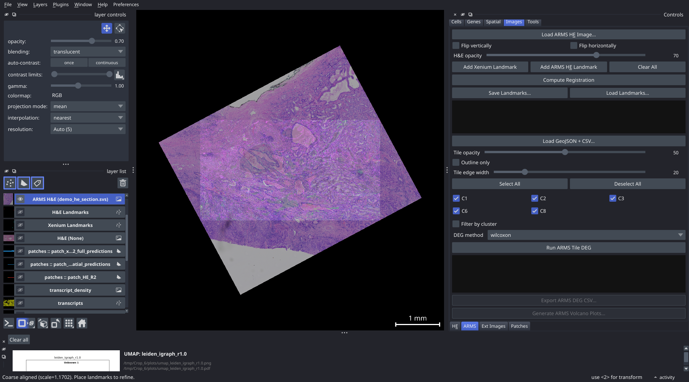
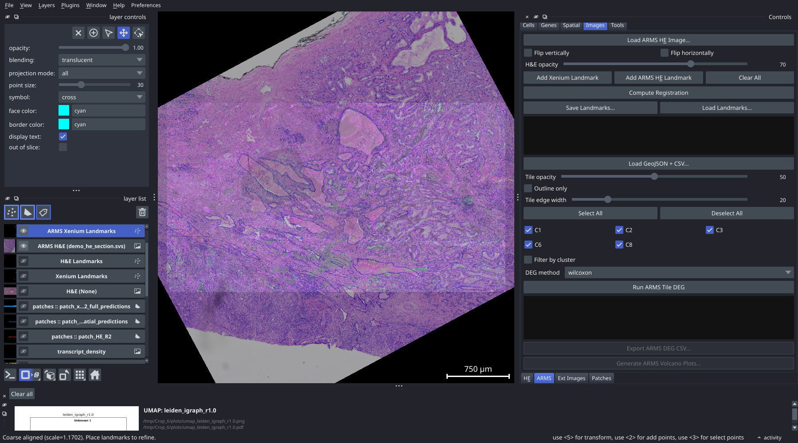
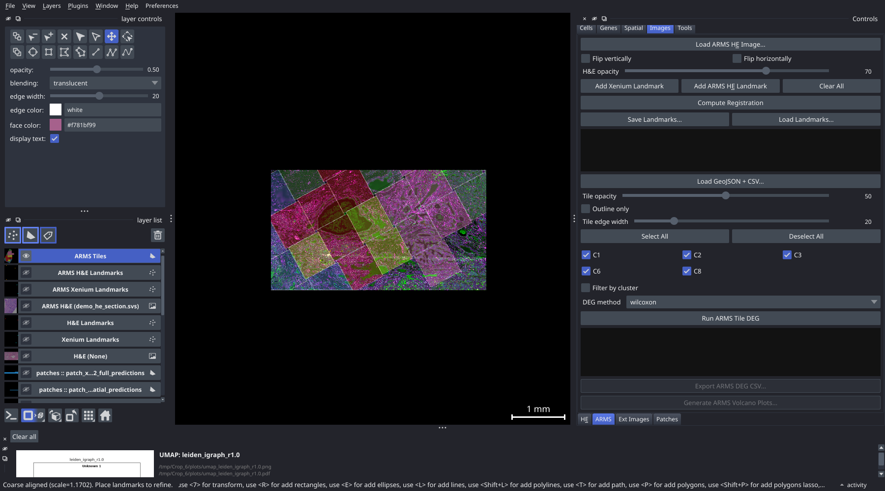
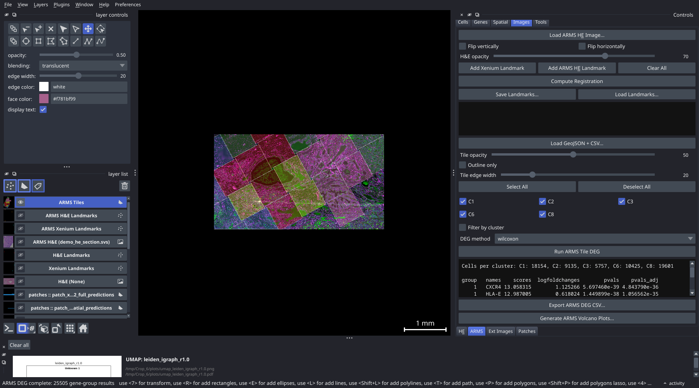

# ARMS Image Registration and Tile Overlay

**Prerequisites:** Viewer loaded with a dataset; an ARMS H&E image file; a GeoJSON file with tile boundary polygons; a CSV file mapping tile names to cluster IDs

**Time required:** ~20–40 minutes

---

## Overview

The ARMS workflow registers a separate ARMS H&E image to the Xenium canvas, then overlays coloured tile polygons derived from ARMS spatial clustering. You can then run differential expression analysis comparing Xenium cells within each ARMS tile cluster.

---

## Part 1: Register the ARMS image

### Step 1. Open the ARMS tab

In the control panel, open the **Images** group and click the **ARMS Overlay** tab.

### Step 2. Load the ARMS H&E image

Click **Load ARMS H&E Image...** and select your image file. The image appears as a new layer in the napari canvas.

### Step 3. Apply flips if needed

If the ARMS image is mirrored or inverted relative to the Xenium image, toggle **Flip vertically** and/or **Flip horizontally** until the tissue orientation matches.

### Step 4. Place landmark pairs

Place at least 3 landmark pairs linking the same tissue features across the Xenium morphology image and the ARMS image. The procedure is identical to H&E registration:

a. Click **Add Xenium Landmark**, then click a recognisable feature in the Xenium morphology image.
b. Click **Add ARMS H&E Landmark**, then click the same feature in the ARMS image.
c. Repeat for at least 3 features (5–10 recommended), distributed across the tissue.

### Step 5. Compute the registration

Click **Compute Registration**. Inspect the residuals display. Values under ~20 µm are generally acceptable. Remove and replace any landmark with an unusually high residual.

### Step 6. Save the landmarks

Click **Save Landmarks...** and choose a save location. The JSON file records the landmark coordinates and computed transform.

---

## Part 2: Load tile polygons

### Step 7. Load the GeoJSON and CSV files

Click **Load GeoJSON + CSV...**. A two-step file dialog opens:

1. First, select the **GeoJSON file** containing the tile boundary polygons. Each feature in the file must have a `tile_name` property matching the names in the CSV.
2. Then, select the **CSV file** mapping tiles to clusters. The CSV must contain at least two columns:
   - `tile_name` — matches the GeoJSON feature names
   - `cluster_id` — integer or string cluster assignment

The tiles appear on the canvas as coloured polygons, one colour per unique `cluster_id` value.

### Step 8. Adjust tile appearance

Use the following controls to make the overlay easier to read:

- **Tile opacity** — controls polygon fill transparency (0 = fully transparent, 1 = fully opaque)
- **Outline only** — when checked, polygons are drawn as outlines with no fill; useful for verifying alignment against the morphology image
- **Tile edge width** — controls the thickness of polygon borders in pixels

Pan around the tissue at multiple zoom levels to verify that tile boundaries align with the ARMS image and Xenium morphology.

---

## Part 3: Run tile DEG analysis

### Step 9. Select tile clusters for comparison

Each ARMS cluster appears as a row with a checkbox. Check at least 2 clusters you want to compare. Each selected cluster must contain at least 10 Xenium cells that fall within its tile boundaries; the viewer shows cell counts per cluster to help you select groups with adequate numbers.

### Step 10. Choose a DEG method

Select a method from the **DEG method** dropdown. `wilcoxon` is recommended for most datasets. `t-test` is faster for very large cell counts.

### Step 11. Run the DEG analysis

Click **Run ARMS Tile DEG**. The viewer identifies Xenium cells within each tile polygon, then runs pairwise differential expression between the selected cluster groups. Top differentially expressed genes appear in the results text area.

### Step 12. Export results

- Click **Export ARMS DEG CSV...** to save the full ranked gene list for all cluster comparisons to a CSV file.
- Click **Generate ARMS Volcano Plots...** and choose a directory. One PNG volcano plot is saved for each pairwise cluster comparison.

---

## Notes

- The ARMS registration and tile layer are saved automatically to `sdata_cached.zarr` and restored on the next launch.
- If your GeoJSON coordinates are in a different coordinate system than the Xenium canvas (e.g. physical micrometres vs pixels), you may need to rescale the coordinates before loading. The viewer assumes GeoJSON coordinates are in the same pixel space as the Xenium image after applying the registration transform.
- To reload a saved ARMS registration in a future session, click **Load Landmarks...** in the ARMS tab and select the previously saved JSON file.

---

## Next steps

- [Tutorial-ROI-Analysis](Tutorial-ROI-Analysis) — free-draw ROI polygons and run DEG analysis
- [Tab-ARMS-Overlay](Tab-ARMS-Overlay) — full reference for the ARMS Overlay tab
