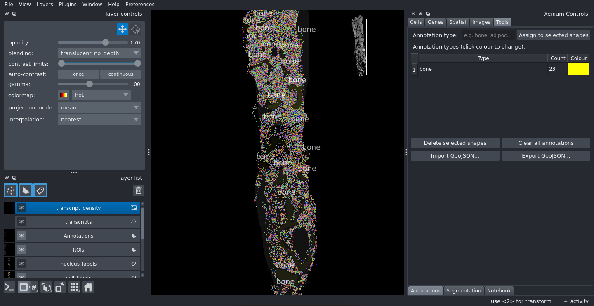
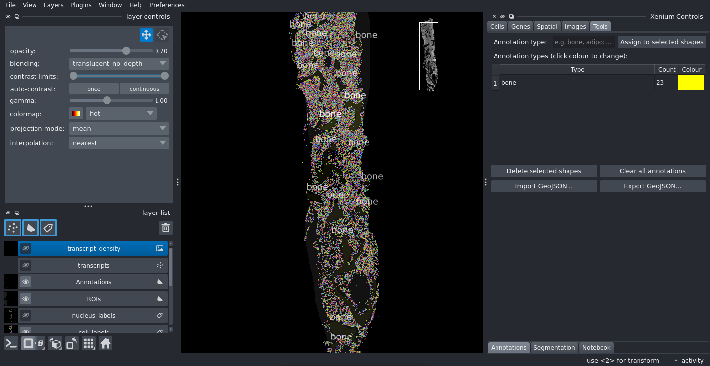

# Drawing and Exporting Tissue Annotations

**Prerequisites:** Viewer loaded with a dataset

**Time required:** ~10–20 minutes

---

## Overview

Tissue annotations let you label regions of the slide with named types such as `tumour`, `stroma`, or `vessel`. Annotated regions are used in the Annotation Neighbourhood and Annotation Distance tabs for spatial analysis, and can be exported as GeoJSON for use in other tools.

---

## Steps

### 1. Select the Annotations layer

In the **napari layer list** on the left, click on the **Annotations** Shapes layer to make it active. The layer highlights to show it is selected.

### 2. Draw annotation polygons

Select the **polygon tool** in the napari toolbar (or press `P`). Click to place each vertex of your region boundary. Press **Enter** to close and finalise the polygon.

Repeat for each tissue region you want to annotate. You can draw multiple polygons before assigning types — the type assignment step is done separately.

**Tips:**
- Use the rectangle tool (`R`) for quick rectangular regions.
- Zoom in before drawing fine boundaries; zoom out for large tissue compartments.
- If you have a registered H&E image, use it as a visual guide while keeping the Annotations layer active.

### 3. Open the Annotations tab

In the control panel, go to **Tools** and click the **Annotations** tab.

### 4. Assign an annotation type to selected shapes

a. In the napari canvas, click a polygon to select it. Hold Shift and click to select multiple polygons of the same type.
b. In the **Annotation type:** text field in the Annotations tab, type a label (for example `tumour`, `stroma`, `vessel`, or `necrosis`).
c. Click **Assign to selected shapes**.

The type table below updates to show each defined type with a count of how many shapes carry that label.

### 5. Customise annotation colours

In the type table, click the colour cell next to a type name to open a colour picker. Choose a colour that distinguishes the type clearly from the canvas background and from other annotation types. The polygon fill colour updates on the canvas immediately.

### 6. Repeat for each annotation type

Repeat steps 2–5 for each tissue region type you need. Work through the tissue systematically — for example, annotate all tumour regions first, then all stroma regions.

### 7. Export as GeoJSON

Click **Export GeoJSON...** and choose a save path. The exported file contains:

- One GeoJSON Feature per polygon
- Each feature's `properties` object includes the `annotation_type` and the assigned colour

The coordinates are in the Xenium pixel coordinate system. To convert to physical micrometres, multiply by the pixel size (typically 0.2125 µm/pixel, found in `experiment.xenium`).

---

## Importing annotations in another session

To load annotations saved in a previous session or shared by a collaborator:

1. Select the Annotations layer in the layer list.
2. In the Annotations tab, click **Import GeoJSON...** and select the file.

Imported shapes are appended to any existing annotation polygons. Type assignments and colours are restored from the file.

---

## Managing existing annotations

| Action | How to do it |
|---|---|
| Remove selected shapes | Select shapes in the canvas, then click **Delete selected shapes** in the tab |
| Remove all annotations | Click **Clear all annotations** (a confirmation dialog appears before anything is deleted) |
| Rename a type | Re-select the shapes and assign a new type name; the old type disappears from the table if no shapes carry it |
| Change a shape's type | Select the shape(s) and click **Assign to selected shapes** with the new type name |

---

## Notes

- Annotations are saved automatically to `sdata_cached.zarr` when you close the viewer and restored on the next launch.
- Annotation types defined here appear in the **Annot Nhood** and **Annot Dist** tabs, where you can measure cell-type enrichment and distance relationships relative to each annotation class.
- Overlapping polygons of different types are allowed; each polygon is treated independently in spatial analysis.
- GeoJSON files can be opened in QGIS, Python (`geopandas`), or R (`sf`) for further processing.

---

## Next steps

- [Tutorial-ROI-Analysis](Tutorial-ROI-Analysis) — draw ROI polygons for differential expression analysis
- [Tab-Neighborhood-Enrichment](Tab-Neighborhood-Enrichment) — compute cell-type neighbourhood enrichment relative to annotation regions
- [Interface-Overview](Interface-Overview) — full reference for all control panel tabs
