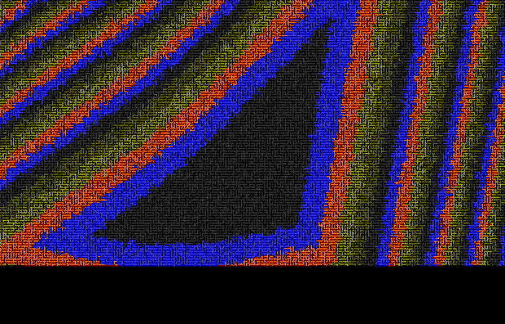
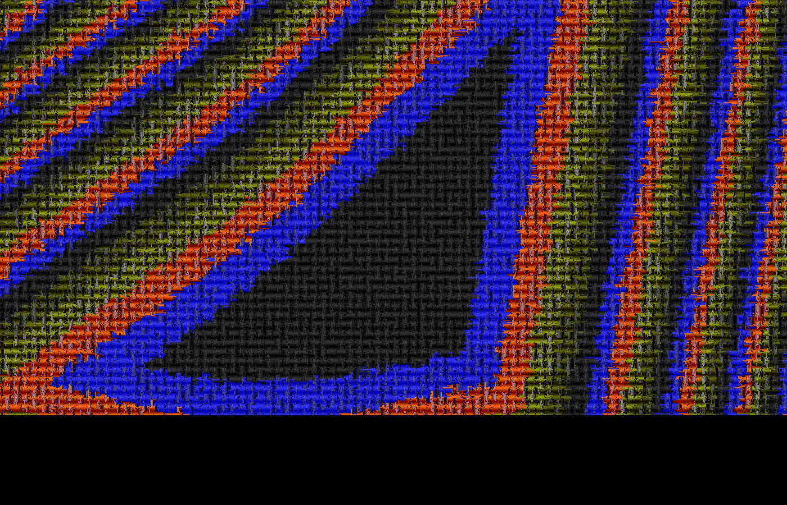
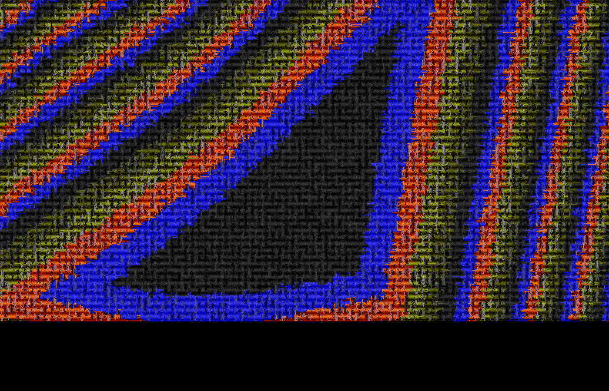
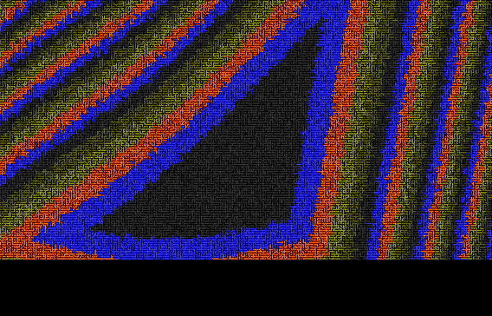

# Clustering and Differential Gene Expression

**Prerequisites:** Viewer loaded with a dataset

**Time required:** ~20 minutes

---

## Steps

### 1. Run Leiden clustering

1. In the control panel, open the **Cells** group and click the **Clustering** tab.
2. Set **Resolution** to `1.0` (higher values produce more clusters; lower values produce fewer).
3. Leave **Neighbours** and **Principal components** at their defaults unless you have a reason to change them.
4. Leave **flavor** at `igraph` — it is much faster. Switch it to `leidenalg` only if you are reproducing an existing scanpy pipeline that used that backend; the two optimise different objectives and give different partitions, so both can be run at one resolution and compared.
5. Leave **Use HVGs only** and **Scale (max_value=10)** unticked for a first pass. Both are off by default because a Xenium panel is a few hundred targeted genes rather than a transcriptome — selecting highly variable genes from it discards a large fraction of a panel that was already curated. Tick them if you are matching a scRNA-seq pipeline that did the same.
6. Click **Run Leiden Clustering**.

The viewer runs PCA, constructs a neighbourhood graph, and runs the Leiden algorithm. When it finishes, a new clustering key `leiden_igraph_r1.0` appears in the clustering dropdowns throughout the interface — the name records the flavour and resolution, so runs at different settings sit alongside each other rather than replacing one another.

Ticking either checkbox changes which code runs, not just its arguments: see [`clustering.leiden`](Analysis-Templates#clusteringleiden) for the four variants and exactly what each one does.

### 2. Colour cells by cluster

1. Open the **Coloring** tab (Cells group).
2. Set **Colour by** to **Cluster**.
3. Select `leiden_igraph_r1.0` from the **Clustering** dropdown.
4. Click **Apply Cell Coloring**.

Each cluster is assigned a distinct colour. The cell label layer updates immediately.

### 3. View the cluster UMAP

1. Open the **UMAP** tab (Cells group).
2. Click **Show UMAP Window** (or bring the existing UMAP window to the front if it is already open).

The UMAP scatter plot updates to match the cluster colouring. Each point represents one cell; colours correspond to clusters.

### 4. Run rank genes (differential expression)

1. Open the **Genes** group and click the **Rank Genes** tab.
2. Select `leiden_igraph_r1.0` from the **Clustering** dropdown.
3. Set **Method** to `wilcoxon` (recommended for count data).
4. Set **Top N genes** to `25`.
5. Click **Run Rank Genes**.

The viewer calls `scanpy.tl.rank_genes_groups` comparing each cluster against all others. Results appear in the results table.

### 5. View the dotplot

Click **Show Dotplot**. A scanpy dotplot opens in its own window: one row per cluster, one column per marker gene, dot size showing the fraction of cells in which the gene was detected and dot colour its mean expression. The plot is saved as a PNG in your output directory at the same time.

The window belongs to matplotlib rather than to the viewer, so it can be resized, panned and saved again from its own toolbar — and closing it does not affect the results, which stay in the Rank Genes table.

### 6. Edit cluster labels

Click **Edit Cluster Labels...** to open the label editor. For each cluster you can type a descriptive name (for example, rename cluster `0` to `Epithelial`). Click **Apply** when done.

Renamed labels propagate to:
- The colour legend in the UMAP window
- The **Colour by Cluster** colouring on the canvas
- All exported CSV and plot files

### 7. Export the full DEG results

Click **Export Full Results CSV...** and choose a save location. The file contains scores, log-fold changes, adjusted p-values, and gene names for every cluster, suitable for downstream analysis in R or Python.

### 8. Save a UMAP plot

1. In the **UMAP** tab, select `leiden_igraph_r1.0` from the **Clustering** dropdown.
2. Set the output format to `PNG`.
3. Click **Save UMAP Plot...** and choose a save location.

The saved figure uses the same cluster colours as the canvas and includes a legend, making it suitable for publication.

---

## Notes

- Clustering results are saved automatically to `sdata_cached.zarr` and restored on the next launch; you do not need to re-run clustering each session.
- You can run clustering at multiple resolutions (e.g. `0.5`, `1.0`, `2.0`) and switch between them using the dropdowns throughout the interface.
- **Ranked genes are stored per clustering.** Ranking a second clustering does not overwrite the first, so you can rank at several resolutions and compare them — each result is keyed by the clustering it came from, and the dotplot and export always follow the clustering currently selected.
- Every step here is recorded as it runs. The [Notebook](Tab-Notebook) tab shows the code, and an exported `.ipynb` replays it from the raw Xenium output — so this tutorial's result is reproducible without repeating the clicks.
- To compare two specific clusters rather than one-vs-all, use the ROI DEG workflow described in [Tutorial-ROI-Analysis](Tutorial-ROI-Analysis).

---

## Next steps

- [Tutorial-ROI-Analysis](Tutorial-ROI-Analysis) — spatially defined differential expression
- [Tab-Rank-Genes](Tab-Rank-Genes) — full reference for the Rank Genes tab
- [Tab-Clustering](Tab-Clustering) — full reference for the Clustering tab
