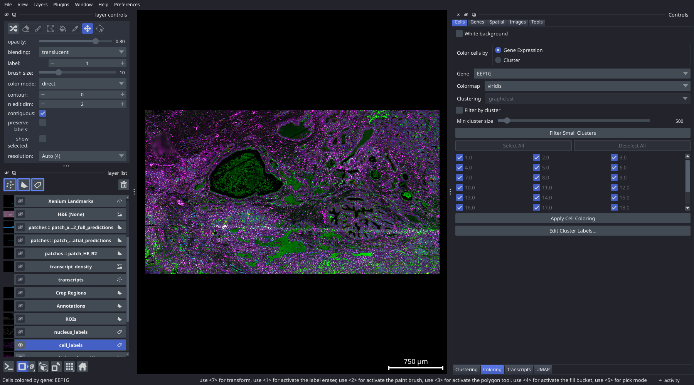
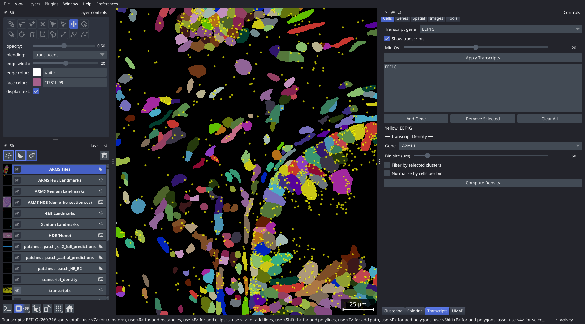
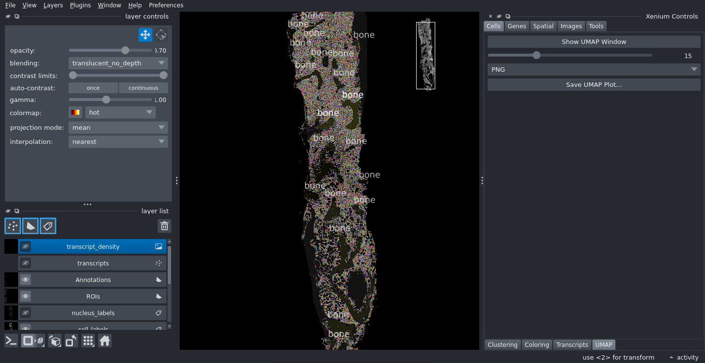

# Getting Started

**Prerequisites:** PALMS installed; a Xenium output directory available (containing `experiment.xenium`)

**Time required:** ~10 minutes

---

## Steps

### 1. Launch the viewer

Run the viewer from the terminal, passing the path to your Xenium output directory:

```bash
palms /path/to/xenium/output/
```

If you omit the path, a file dialog opens so you can select the directory interactively:

```bash
palms
```


### 2. Wait for the initial load

On the first launch, the viewer builds a zarr cache (`sdata_cached.zarr/`) inside your output directory. This takes **3–10 minutes** depending on dataset size, and on a full slide the cache is around 14 GB, so make sure there is room. Subsequent launches use the cache and take only **10–30 seconds**.

A progress bar appears in the terminal and at the bottom of the viewer window while loading. The terminal also reports memory per element as each one is written — a full slide peaks around 9 GB and stays flat across the write.

If the dataset directory is read-only, or you only want a quick look, `--no-cache` will start without writing anything. On a full slide it is expensive rather than merely slower: see **Memory** in [Installation](Installation) before reaching for it.

### 3. Navigate the canvas

Once loaded, use the following controls to move around:

| Action | Control |
|---|---|
| Pan | Middle-click drag, or Ctrl+drag |
| Zoom | Scroll wheel |
| Fit image to window | Press Space |
| Reset zoom | Press Ctrl+Shift+H |


### 4. Understand the morphology image

The default image layer (`morphology_focus`) is a 4-channel fluorescence image with the following channels:

| Channel index | Stain |
|---|---|
| 0 | DAPI |
| 1 | ATP1A1 / CD45 / E-Cadherin |
| 2 | 18S |
| 3 | AlphaSMA / Vimentin |

You can toggle individual channels on and off by clicking their eye icons in the **layer list** on the left side of the napari window. Adjust brightness and contrast with the sliders that appear when a layer is selected.

### 5. Colour cells by gene expression

1. In the control panel on the right, open the **Cells** group and click the **Coloring** tab.
2. Set the **Colour by** dropdown to **Gene Expression**.
3. Choose a gene from the gene dropdown.
4. Select a colour map (e.g. `magma` or `viridis`).
5. Click **Apply Cell Coloring**.

The cell label layer updates to reflect per-cell expression levels.



### 6. View transcripts for a gene

1. Open the **Transcripts** tab (Cells group).
2. Select a gene from the **Transcript gene** dropdown.
3. Click **Add Gene** to add it to the list.
4. Click **Apply Transcripts**.

Individual transcript dots appear on the canvas. Use the **Min QV** slider to filter out low-quality transcripts (quality value below the threshold).



### 7. Open the UMAP window

1. Open the **UMAP** tab (Cells group).
2. Click **Show UMAP Window**.

A separate window opens showing a scatter plot of the cells in UMAP space, linked to the main canvas. Lassoing cells in the UMAP highlights them on the spatial canvas, and vice versa.



### 8. Close the viewer

Close the napari window normally (click the X or press Ctrl+Q). Your session — including the current clustering, gene selection, H&E registration, and ROI polygons — is **saved automatically** and restored the next time you launch the viewer on the same dataset.

---

## Next steps

- [Tutorial-Clustering](Tutorial-Clustering) — run Leiden clustering and differential expression
- [Tutorial-HE-Registration](Tutorial-HE-Registration) — register an H&E image to the Xenium canvas
- [Interface-Overview](Interface-Overview) — full reference for every control panel tab
